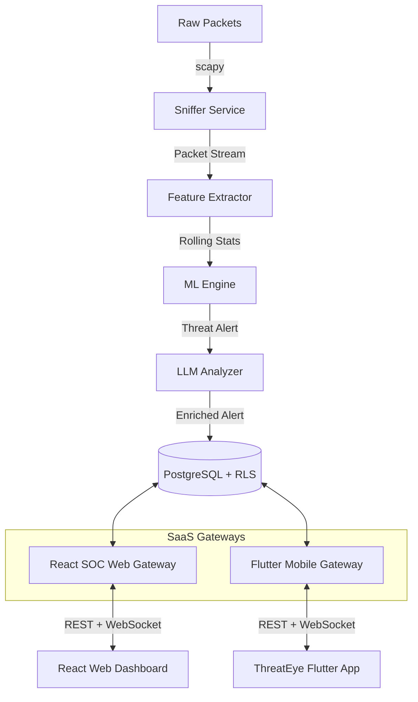

# 🛡️ CypherGuard — AI-Powered Multi-Tenant SaaS SOC & Intrusion Detection System

[](https://www.python.org/)
[](https://flutter.dev/)
[](https://react.dev/)
[](https://fastapi.tiangolo.com/)
[](https://www.postgresql.org/)
[](https://redis.io/)
[](https://www.docker.com/)

**CypherGuard** is a production-grade, event-driven, multi-tenant SaaS Security Operations Center (SOC) and Intrusion Detection System (IDS). It captures real-time network traffic, classifies threats with Machine Learning (scikit-learn) + Generative AI (GPT-4o), enables human-in-the-loop decisions through a Flutter mobile app (`ThreatEye`) and React Web dashboard, and guarantees strict tenant isolation under Row-Level Security (RLS) policies.

## 🎥 System Demo Video

<video src="2026-06-14%2019-21-13.mp4" width="100%" controls></video>

_If the video player above does not load, you can view or download the demo video directly [here]([2026-06-14%2019-21-13.mp4](https://drive.google.com/file/d/1yieVtKRwgzPdBeRfOkSOWB1Vui-i5JI2/view?usp=sharing))._

---

## 🏗️ Architecture & Data Flow



* **Ingestion Pipeline**: The Sniffer captures raw network packets and streams them via Redis consumer groups to the Feature Extractor.
* **ML & AI Analysis**: The ML Engine runs real-time inferences and flags anomalies. The LLM Analyzer enriches security alerts with GPT-4o-mini, writing raw logs, feature metrics, and recommendations directly to PostgreSQL.
* **Multi-Tenant Gateways**: The Web Dashboard and Mobile Gateway (`/v1/mobile/*`) serve their respective client applications. All connections are tenant-scoped using JWT claims.

---

## 🔒 Strict Tenant Isolation (SaaS Security Guardrails)

CypherGuard enforces a robust security architecture to prevent cross-tenant data leakage:
1. **Tenant Identity Rule**: The `tenant_id` is derived **ONLY** from the validated JWT token (`tid` claim) decoded server-side.
2. **Override Protections**: Any API requests attempting to manually pass `tenant_id` or `tenant` in the request body, query parameters, or HTTP headers are automatically intercepted and rejected with `403 Forbidden`.
3. **Database Row-Level Security (RLS)**: PostgreSQL sessions set `app.tenant_id = :tid` at the start of transactions, limiting visibility and edit operations to the tenant's own records.
4. **WebSocket Scoping**: Handshakes for `/ws/mobile` require a JWT inside the connection parameters. The WebSocket connections are grouped by `tenant_id` in memory to ensure broadcasts do not leak across organizations.

---

## 📂 Project Directory Structure

```text
CypherGuard/
├── app/threateye/        # ThreatEye Flutter Mobile Application
├── soc-frontend/         # React Web SOC Dashboard (Vite + TypeScript)
├── gateway/              # Web Dashboard Gateway (REST + WebSockets)
├── mobile_gateway/       # Mobile Gateway (FastAPI, versioned under /v1/mobile)
├── ml_engine/            # ML inference service, retraining, and drift detection
├── sniffer/              # Live packet capturing service (scapy)
├── extractor/            # Network feature engineering
├── control_plane/        # Centralized decision logic and routing
├── firewall/             # IP blocking / iptables rules controller
├── shared/               # Shared backend modules (auth, database, metrics, responses)
├── tests/                # Automated pytest suite (auth, API, isolation)
└── alembic/              # Database migration schemas
```

---

## 🚀 Getting Started

### 1. Configure the Environment
Generate the required cryptographic secrets and copy the base configurations:
```bash
# Generate keys
python scripts/generate_secrets.py --write

# Or copy manually
cp .env.example .env
```
Edit the `.env` file to provide your Database URL, Redis URL, OpenAI API Key, and verify that `JWT_SECRET` and `INTERNAL_API_KEY` are populated with secure keys (minimum 16 characters).

### 2. Run Database Migrations
Deploy the database schema using Alembic:
```bash
# Initialize schema
alembic upgrade head
```

### 3. Start the Backend Infrastructure
Use Docker Compose profiles to boot the backend services:
```bash
# Start Core SOC Stack
docker compose up -d

# Start SOC Stack + Monitoring (Prometheus & Grafana)
docker compose --profile observability up -d
```

### 4. Build and Run the Flutter Mobile App (ThreatEye)
To build the Flutter mobile client to connect to your specific deployment backend dynamically, build using `--dart-define` parameters:
```bash
cd app/threateye

# Get dependencies
flutter pub get

# Run on emulator/device
flutter run --dart-define=API_BASE_URL=http://<EC2-IP>:8005 --dart-define=WS_BASE_URL=ws://<EC2-IP>:8005/ws/mobile
```

---

## 🧪 Integration Testing Suite

CypherGuard includes a comprehensive test suite in [tests/test_mobile_gateway_isolation.py](tests/test_mobile_gateway_isolation.py) that executes locally without requiring a live PostgreSQL instance.

* **SQLite RLS Emulator**: The tests utilize a local SQLite file (`test_db_isolation.sqlite`) and map PostgreSQL `UUID` and `JSONB` datatypes to SQLite-compatible strings dynamically.
* **AST Hooking**: A custom event listener on `Session` intercepts query AST compilation and appends a `.where(cls.tenant_id == t_uuid)` clause, emulating multi-tenant row isolation.
* **Execute Tests**:
```bash
python -m pytest tests/test_mobile_gateway_isolation.py -v
```

---

## 📊 Observability Matrix

| Tool | Port | Endpoint / Purpose |
|---|---|---|
| **Web Dashboard** | `5173` | UI for system administrators |
| **API Gateway** | `8000` | Gateway for Web Dashboard requests |
| **Mobile Gateway** | `8005` | Gateway for mobile (`ThreatEye`) clients |
| **Prometheus** | `9090` | System metrics aggregator |
| **Grafana** | `3000` | Observability dashboards (ops, security, ML) |
| **Alertmanager** | `9093` | Alert routing |

---

## 📜 License
This project is developed as a graduation project. All rights reserved.
