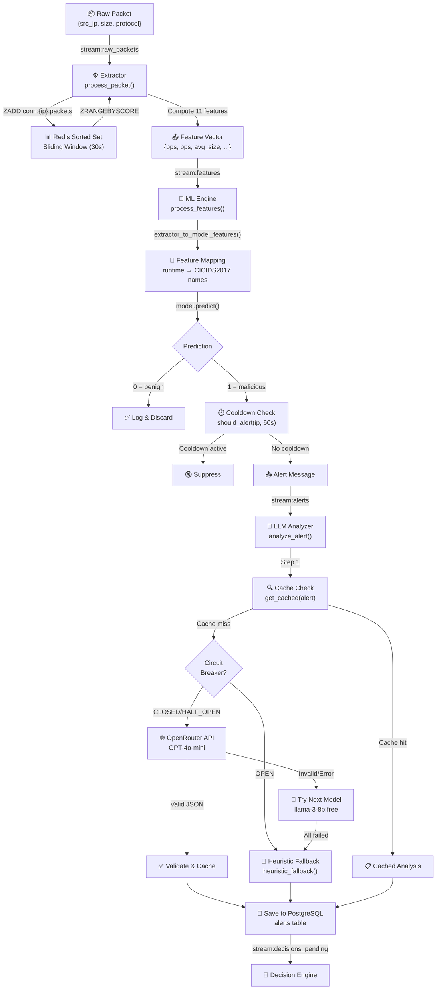
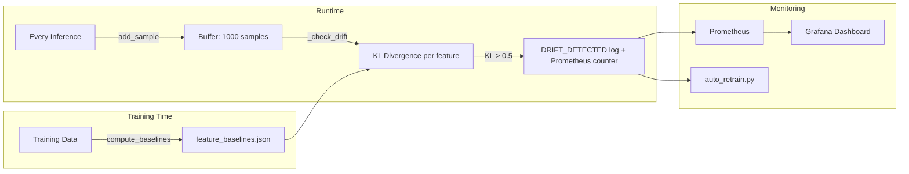

# CypherGuard AI Subsystem — Complete Deep Dive

> Written for the AI Engineer responsible for this subsystem.  
> From beginner intuition → mathematical foundations → line-by-line code → production engineering.

---

## Table of Contents

1. [Why Does the AI Subsystem Exist?](#1-why-does-the-ai-subsystem-exist)
2. [What Problem Does Each AI Component Solve?](#2-what-problem-does-each-ai-component-solve)
3. [Complete AI Data Flow](#3-complete-ai-data-flow)
4. [File Map — Every File, Class, Function](#4-file-map)
5. [The 11 Features — What, Why, and How](#5-the-11-features)
6. [Training Dataset — Structure and Requirements](#6-training-dataset)
7. [Preprocessing Pipeline](#7-preprocessing-pipeline)
8. [Feature Engineering — The Math](#8-feature-engineering-math)
9. [Model Inference — Step by Step](#9-model-inference)
10. [Confidence Scores and Probabilities](#10-confidence-scores)
11. [Drift Detection and KL Divergence](#11-drift-detection)
12. [LLM Analyzer Architecture](#12-llm-analyzer)
13. [Caching, Bucketing, and Fallback Logic](#13-caching-and-fallback)
14. [Design Decisions and Tradeoffs](#14-design-decisions)
15. [Retrain, Evaluate, Improve, Deploy](#15-retrain-lifecycle)

---

## 1. Why Does the AI Subsystem Exist?

### The Problem Without AI

Imagine you're a security analyst watching a screen with raw network data scrolling by:

```
192.168.1.50 → 10.0.0.1 | TCP | 1400 bytes
192.168.1.50 → 10.0.0.1 | TCP | 1400 bytes
10.0.0.5    → 10.0.0.1 | UDP | 64 bytes
192.168.1.50 → 10.0.0.1 | TCP | 1400 bytes
...
```

You see thousands of packets per second. Which ones are dangerous? You can't tell by looking at individual packets. An attacker sending 5000 large packets per second looks identical to a single large file download — until you zoom out and see the *pattern over time*.

### What AI Gives Us

The AI subsystem solves two fundamentally different problems:

| Component | Problem It Solves | Type of AI |
|---|---|---|
| **ML Engine** | "Is this traffic pattern benign or malicious?" | **Traditional ML** (supervised binary classification) |
| **LLM Analyzer** | "If it's malicious, what kind of attack is it and what should we do?" | **Generative AI** (LLM reasoning) |

**Why two layers?** Because they solve different problems:

- The **ML model** is fast (~2ms), cheap (zero API cost), and runs on every packet flow. But it can only say "yes" or "no" — it can't explain *why* or suggest *what to do*.
- The **LLM** is slow (~500ms-2s), expensive (API cost per call), and called only when the ML model flags something. But it provides human-readable explanations, attack type classification, and actionable recommendations.

This is a **division of labor** pattern common in production AI systems: use a fast/cheap model for high-throughput filtering, then a slow/expensive model for rare but important cases.

---

## 2. What Problem Does Each AI Component Solve?

### 2.1 Extractor (Feature Engineering)

**File:** [extractor/main.py](file:///d:/final-soc/CypherGuard/extractor/main.py)

**Problem:** Raw packets are just `(src_ip, size, protocol)` — the ML model can't classify a single packet. It needs *behavioral features* computed over a *time window*.

**Solution:** The Extractor maintains a 30-second sliding window per source IP using Redis sorted sets. Every time a new packet arrives, it adds the packet to the window, computes 11 statistical features from all packets in that window, and publishes them for the ML model.

**Analogy:** Think of a doctor taking your temperature once — it tells them nothing. But if they record your temperature every hour for 24 hours and see it steadily rising from 37°C to 40°C, they can diagnose a fever. The Extractor is the thermometer that takes continuous measurements and computes the trend.

---

### 2.2 ML Engine (Classification)

**File:** [ml_engine/main.py](file:///d:/final-soc/CypherGuard/ml_engine/main.py)

**Problem:** We have 11 numbers describing a traffic pattern. Is this pattern benign or malicious?

**Solution:** A scikit-learn `Pipeline` containing a `StandardScaler` + `RandomForestClassifier` (or XGBoost/LightGBM/CatBoost depending on which won the training competition). The model was trained on the CICIDS2017 dataset, a labeled dataset of real network traffic containing both benign and various attack types.

**Analogy:** Think of a spam filter for email. You give it features (word counts, sender reputation, etc.) and it says "spam" or "not spam." Our ML model does the same thing but for network traffic, using features like "packets per second" and "average packet size" instead of word counts.

---

### 2.3 LLM Analyzer (Enrichment)

**File:** [llm_analyzer/main.py](file:///d:/final-soc/CypherGuard/llm_analyzer/main.py)

**Problem:** The ML model says "malicious" with 94% confidence. But the human analyst needs to know: *What type of attack? How severe? What should I do?*

**Solution:** Send the traffic statistics to GPT-4o-mini (via OpenRouter API), which acts as a "senior SOC analyst" and produces a structured JSON response with `attack_type`, `severity`, `explanation`, and `recommendation`.

**Analogy:** The ML model is like a fire alarm — it beeps when there's smoke. The LLM is like the fire chief who arrives, inspects the scene, and says "This is an electrical fire from the kitchen, severity is high, evacuate and call a specialist."

---

### 2.4 Drift Detector (Model Health Monitor)

**File:** [shared/drift_detector.py](file:///d:/final-soc/CypherGuard/shared/drift_detector.py)

**Problem:** ML models are trained on historical data. If the real-world data starts looking different from the training data (new attack patterns, infrastructure changes, etc.), the model's predictions become unreliable — but it doesn't know that.

**Solution:** Monitor the distribution of each feature at runtime and compare it against the distribution from training time using KL Divergence (a mathematical measure of how different two probability distributions are). If the divergence exceeds a threshold, alert the team that the model may need retraining.

**Analogy:** Imagine you trained a dog to catch frisbees in a park. If you move to a beach, the wind and sand change how the frisbee flies. The dog still tries to catch it the same way, but misses more often. The drift detector is like noticing "hey, the conditions changed" before the dog starts failing.

---

## 3. Complete AI Data Flow

Here is the exact journey of data through every AI component, with the actual Redis stream names and function calls:



---

## 4. File Map

### Every AI file with its role

| File | Role | Key Functions/Classes |
|---|---|---|
| [extractor/main.py](file:///d:/final-soc/CypherGuard/extractor/main.py) | Feature computation from raw packets | `process_packet()`, `consumer_loop()`, `metrics_publisher_loop()` |
| [shared/redis_client.py](file:///d:/final-soc/CypherGuard/shared/redis_client.py) | Sliding window math in Redis | `update_conn_stats()`, `get_conn_features()`, `should_alert()` |
| [ml_engine/feature_engineering.py](file:///d:/final-soc/CypherGuard/ml_engine/feature_engineering.py) | Feature definitions + name mapping + training data prep | `FEATURE_COLUMNS`, `EXTRACTOR_TO_CICIDS`, `extractor_to_model_features()`, `prepare_training_data()` |
| [ml_engine/main.py](file:///d:/final-soc/CypherGuard/ml_engine/main.py) | ML inference service | `process_features()`, `consumer_loop()`, `load_model_if_changed()`, `model_watcher_loop()` |
| [ml_engine/train_production.py](file:///d:/final-soc/CypherGuard/ml_engine/train_production.py) | Full training pipeline with model comparison | `train_and_evaluate()`, `log_experiment_to_db()` |
| [ml_engine/create_demo_model.py](file:///d:/final-soc/CypherGuard/ml_engine/create_demo_model.py) | Synthetic data generator for demos | `generate_synthetic_data()`, `train_demo_model()` |
| [ml_engine/auto_retrain.py](file:///d:/final-soc/CypherGuard/ml_engine/auto_retrain.py) | Automatic retraining on drift | `check_drift_and_retrain()`, `trigger_retraining()`, `monitor_loop()` |
| [ml_engine/model_monitoring.py](file:///d:/final-soc/CypherGuard/ml_engine/model_monitoring.py) | Live accuracy/F1/latency/drift monitoring | `run_monitoring_cycle()`, `monitor_loop()` |
| [llm_analyzer/main.py](file:///d:/final-soc/CypherGuard/llm_analyzer/main.py) | LLM-based threat enrichment | `analyze_alert()`, `heuristic_fallback()`, `process_alert_message()` |
| [shared/llm_config.py](file:///d:/final-soc/CypherGuard/shared/llm_config.py) | Prompt templates + LLM response validation | `get_prompt()`, `validate_llm_response()`, `LLMAnalysisResponse`, `MODEL_FALLBACK_CHAIN` |
| [shared/circuit_breaker.py](file:///d:/final-soc/CypherGuard/shared/circuit_breaker.py) | Protects LLM calls from cascading failure | `CircuitBreaker`, `can_execute()`, `record_success()`, `record_failure()` |
| [shared/drift_detector.py](file:///d:/final-soc/CypherGuard/shared/drift_detector.py) | KL divergence drift monitoring | `DriftDetector`, `add_sample()`, `_check_drift()`, `compute_baselines()` |

---

## 5. The 11 Features

Every feature is defined in [FEATURE_COLUMNS](file:///d:/final-soc/CypherGuard/ml_engine/feature_engineering.py#L26-L38). Here is what each one means, why it matters for attack detection, and how it is computed.

### Feature Table

| # | CICIDS2017 Name | Runtime Name | What It Measures | Why It Matters for Security |
|---|---|---|---|---|
| 1 | `Flow Bytes/s` | `bytes_per_sec` | Total data rate in bytes per second | DDoS floods have extremely high byte rates |
| 2 | `Flow Packets/s` | `packets_per_sec` | Packet transmission rate | Port scans and SYN floods produce very high packet rates with small payloads |
| 3 | `Avg Packet Size` | `avg_packet_size` | Mean packet payload size | SYN/ACK scans have tiny packets (~40-60B); DDoS floods have large packets (~1400B) |
| 4 | `Flow Duration` | `flow_duration` | Time span from first to last packet in window | Scans are bursty (short duration); normal browsing is sustained |
| 5 | `Total Fwd Packets` | `packet_count` | Count of packets in the window | Raw volume indicator |
| 6 | `Total Length of Fwd Packets` | `total_bytes` | Sum of all packet sizes | Raw bandwidth indicator |
| 7 | `Fwd Packet Length Mean` | `fwd_pkt_len_mean` | Average packet size (same as #3 in this system) | Statistical summary for the model |
| 8 | `Fwd Packet Length Std` | `fwd_pkt_len_std` | Standard deviation of packet sizes | Uniform traffic (Std≈0) suggests automated attack; varied traffic suggests human |
| 9 | `Flow IAT Mean` | `flow_iat_mean` | Mean inter-arrival time between packets | Automated tools send at regular intervals; humans are irregular |
| 10 | `Flow IAT Std` | `flow_iat_std` | Standard deviation of inter-arrival times | Low IAT Std = robotic regularity (scanner/bot). High = human |
| 11 | `Small Packet Ratio` | `small_packet_ratio` | Fraction of packets smaller than 100 bytes | Port scans are almost entirely tiny packets (ratio > 0.8) |

### Why These 11 Specifically?

From [feature_engineering.py](file:///d:/final-soc/CypherGuard/ml_engine/feature_engineering.py#L24-L26) comment:

> We intentionally exclude features that cannot be computed at serving time (e.g., Bwd Packet Length Mean requires bidirectional flow tracking).

The CICIDS2017 dataset has 78+ features, but many require **bidirectional flow reconstruction** — knowing both the request and the response for a TCP connection. Our system only sees raw one-directional packets as they pass through, so we can only compute features from the forward (incoming) direction.

**This is a critical design constraint:** The features you can compute at training time must be *exactly* the features you can compute at serving time. If the training data has features your runtime can't produce, the model won't work in production.

---

## 6. Training Dataset

### CICIDS2017

The model is trained on the **Canadian Institute for Cybersecurity Intrusion Detection Systems 2017** dataset.

**What it is:** 5 days of network traffic captured at the University of New Brunswick. Each day contains normal (benign) traffic mixed with specific attack types:

| Day | Attacks Present |
|---|---|
| Monday | Benign only (baseline) |
| Tuesday | FTP-Patator, SSH-Patator (brute force) |
| Wednesday | DoS Slowhttptest, DoS Hulk, Heartbleed, DoS GoldenEye, DoS slowloris |
| Thursday | Web attacks (SQL injection, XSS, brute force), Infiltration |
| Friday | DDoS, Port Scan, Bot |

**How the dataset looks** (simplified):

```
Flow Bytes/s, Flow Packets/s, Avg Packet Size, ..., Label
1200.5,       3.2,            375.0,           ..., BENIGN
85000.0,      150.0,          567.0,           ..., DDoS
45.0,         80.0,           42.0,            ..., PortScan
```

### How training data is loaded

From [prepare_training_data()](file:///d:/final-soc/CypherGuard/ml_engine/feature_engineering.py#L60-L113):

```python
def prepare_training_data(csv_path: str) -> Tuple[pd.DataFrame, pd.Series]:
```

**Step-by-step walkthrough:**

1. **Load CSV**: `pd.read_csv(csv_path)` — loads the CICIDS2017 CSV file
2. **Clean column names**: `df.columns = df.columns.str.strip()` — CICIDS2017 has trailing spaces in some column names (a known data quality issue)
3. **Check available features**: Compares `FEATURE_COLUMNS` against actual CSV columns. Missing ones are filled with 0
4. **Remove Inf/NaN**: `df.replace([np.inf, -np.inf], np.nan).dropna(...)` — some rows in CICIDS2017 have infinity values in Flow Bytes/s due to zero-duration flows
5. **Build feature matrix X**: Select only the 11 feature columns, in the exact order defined by `FEATURE_COLUMNS`
6. **Encode labels**: `lambda label: 0 if label.strip() == "BENIGN" else 1` — converts multi-class labels (DDoS, PortScan, etc.) to **binary** (0=benign, 1=malicious)

> [!IMPORTANT]
> **Binary classification decision:** The ML model does NOT distinguish between attack types. It only asks "is this malicious?" The attack type classification is handled by the LLM Analyzer. This is an intentional design decision — a binary classifier is simpler, more accurate, and requires less training data than a multi-class classifier.

---

## 7. Preprocessing Pipeline

### The sklearn Pipeline

From [train_production.py](file:///d:/final-soc/CypherGuard/ml_engine/train_production.py#L231-L247):

```python
Pipeline([
    ("scaler", StandardScaler()),
    ("model", RandomForestClassifier(
        n_estimators=100,
        max_depth=20,
        min_samples_split=5,
        min_samples_leaf=2,
        random_state=42,
        n_jobs=-1,
        class_weight="balanced",
    )),
])
```

### What is StandardScaler?

**Problem it solves:** Our features have wildly different scales:
- `packets_per_sec` might range from 0.1 to 5000
- `flow_iat_mean` might range from 0.001 to 10
- `total_bytes` might range from 100 to 10,000,000

Many ML algorithms are sensitive to feature scale — a feature with values in the millions will dominate a feature with values in the thousandths.

**How StandardScaler works mathematically:**

For each feature column, StandardScaler computes:

```
z = (x - μ) / σ
```

Where:
- `x` = the original feature value
- `μ` = the mean of that feature across all training samples
- `σ` = the standard deviation of that feature across all training samples
- `z` = the scaled value (centered at 0, with standard deviation 1)

**Concrete example:** If `packets_per_sec` has mean=50 and std=100:
- A value of 50 → z = (50 - 50) / 100 = 0.0 (exactly average)
- A value of 150 → z = (150 - 50) / 100 = 1.0 (one standard deviation above average)
- A value of 5000 → z = (5000 - 50) / 100 = 49.5 (extremely unusual — likely attack)

### Why it's inside the Pipeline

The `StandardScaler` is saved as part of the `Pipeline` object via `joblib.dump()`. This means:
- The **same** mean and std computed during training are automatically applied during inference
- You never have to worry about computing separate statistics for production data
- When you call `pipeline.predict(X)`, the Pipeline automatically scales first, then predicts

**Production engineering reason:** If the scaler were separate from the model, you'd risk a version mismatch — deploying a new model with the old scaler, or vice versa. Bundling them as a single `Pipeline` ensures atomicity.

### What about RandomForest and scaling?

> [!NOTE]
> Random Forests are actually **not** sensitive to feature scale — they use decision thresholds, not distances. StandardScaler is technically unnecessary for RandomForest. However, it's included because the training pipeline also tests **XGBoost, GradientBoosting, LightGBM, and CatBoost**, and the same Pipeline is used for all. Some gradient boosting implementations can benefit from scaling. It doesn't hurt RandomForest, and it makes the Pipeline work correctly for all candidate models.

---

## 8. Feature Engineering — The Math

All feature computation happens in [redis_client.py → get_conn_features()](file:///d:/final-soc/CypherGuard/shared/redis_client.py#L175-L248). Let me walk through every computation.

### Input Data Structure

Each packet is stored in a Redis Sorted Set as:

```
Member: "1718200000123:1400"     ← timestamp_ms:packet_size
Score:   1718200000123           ← timestamp_ms (for range queries)
```

When we call `ZRANGEBYSCORE key (now - 30000) now`, we get all packets from the last 30 seconds.

### Feature Computations

Given a window of `n` packets with sizes `[s₁, s₂, ..., sₙ]` and timestamps `[t₁, t₂, ..., tₙ]`:

#### 1. packet_count

```python
packet_count = len(sizes)  # = n
```

Simply the number of packets in the window. No math, just a count.

#### 2. total_bytes

```python
total_bytes = sum(sizes)  # = s₁ + s₂ + ... + sₙ
```

#### 3. packets_per_sec

```python
packets_per_sec = packet_count / window_seconds  # = n / 30
```

**Math:** Rate = Count / Time. If we saw 150 packets in 30 seconds → 150/30 = 5 pps.

#### 4. bytes_per_sec

```python
bytes_per_sec = total_bytes / window_seconds
```

#### 5. avg_packet_size

```python
avg_packet_size = total_bytes / packet_count
```

**Math:** This is the arithmetic mean:

```
μ_size = (1/n) × Σ sᵢ
```

#### 6. flow_duration

```python
flow_duration = (max(timestamps) - min(timestamps)) / 1000.0
```

**Math:** The time span from the first to the last packet, converted from milliseconds to seconds.

#### 7. fwd_pkt_len_mean

```python
size_mean = total_bytes / packet_count  # Same as avg_packet_size
```

In this implementation, `fwd_pkt_len_mean` equals `avg_packet_size`. In the CICIDS2017 dataset, they could differ because CICIDS separates forward and backward traffic, but since our system only tracks forward packets, they're the same.

#### 8. fwd_pkt_len_std (Standard Deviation)

```python
size_std = (sum((s - size_mean) ** 2 for s in sizes) / len(sizes)) ** 0.5
```

**Math — step by step:**

1. Compute the mean: `μ = (1/n) × Σ sᵢ`
2. For each packet size, compute the squared difference from the mean: `(sᵢ - μ)²`
3. Average those squared differences (this gives the **variance**): `σ² = (1/n) × Σ (sᵢ - μ)²`
4. Take the square root (this gives the **standard deviation**): `σ = √σ²`

**What it tells us:**
- `σ ≈ 0` → All packets are the same size (bot/attack — very regular)
- `σ large` → Packets have mixed sizes (human browsing — HTML page, images, CSS)

**Example:**
- Packets: [1400, 1400, 1400, 1400] → μ=1400, σ=0 (uniform = DDoS)
- Packets: [200, 1400, 60, 800] → μ=615, σ≈509 (varied = normal)

#### 9. flow_iat_mean (Inter-Arrival Time Mean)

```python
sorted_ts = sorted(timestamps)
iats = [(sorted_ts[i+1] - sorted_ts[i]) / 1000.0 for i in range(len(sorted_ts) - 1)]
iat_mean = sum(iats) / len(iats)
```

**Math:** Inter-Arrival Time (IAT) is the time gap between consecutive packets.

Given sorted timestamps `[t₁, t₂, ..., tₙ]`:

```
IAT₁ = t₂ - t₁
IAT₂ = t₃ - t₂
...
IATₙ₋₁ = tₙ - tₙ₋₁

IAT_mean = (1/(n-1)) × Σ IATᵢ
```

**What it tells us:**
- `IAT_mean ≈ 0.001` (1ms between packets) → Very fast, automated transmission (attack)
- `IAT_mean ≈ 2.0` (2 seconds between packets) → Human-speed interaction (benign)

#### 10. flow_iat_std (Inter-Arrival Time Standard Deviation)

```python
iat_std = (sum((x - iat_mean) ** 2 for x in iats) / len(iats)) ** 0.5
```

Same formula as `fwd_pkt_len_std` but applied to inter-arrival times.

**What it tells us:**
- `IAT_std ≈ 0` → Packets arrive at perfectly regular intervals (bot/scanner)
- `IAT_std large` → Irregular timing (human clicking around)

#### 11. small_packet_ratio

```python
small_count = sum(1 for s in sizes if s < 100)
small_ratio = small_count / packet_count
```

**Math:** Proportion of packets that are smaller than 100 bytes.

```
small_ratio = |{sᵢ : sᵢ < 100}| / n
```

**What it tells us:**
- `small_ratio > 0.8` → 80%+ of packets are tiny → Port scan (SYN packets are ~40 bytes)
- `small_ratio < 0.1` → Most packets are large → Normal file transfers or DDoS

---

## 9. Model Inference — Step by Step

The entire inference path is in [process_features()](file:///d:/final-soc/CypherGuard/ml_engine/main.py#L158-L268). Here is what happens for every single message:

### Step 1: Receive features from Redis Stream

```python
messages = await redis_manager.consume(
    stream="stream:features",
    group="ml_engine_group",
    consumer="ml_worker_1",
    count=20,
    block_ms=3000,
)
```

This reads up to 20 messages from `stream:features`, blocking for up to 3 seconds if none are available.

### Step 2: Extract metadata

```python
src_ip = data.get("src_ip", "")
tenant_id = data.get("tenant_id", None) or None
```

### Step 3: Skip blocked IPs

```python
if await redis_manager.is_blocked(src_ip, tenant_id=tenant_id):
    return
```

**Why:** If we already blocked this IP, there's no point running inference on it. This saves CPU cycles and prevents duplicate alerts.

### Step 4: Convert extractor names → model names

```python
features_df = extractor_to_model_features(data)
```

This calls [extractor_to_model_features()](file:///d:/final-soc/CypherGuard/ml_engine/feature_engineering.py#L120-L161), which:

1. Maps `"packets_per_sec"` → `"Flow Packets/s"`, `"bytes_per_sec"` → `"Flow Bytes/s"`, etc.
2. Converts every value to `float`, replacing NaN/Inf with 0.0
3. Applies **outlier clipping** (domain constraints):
   - `Small Packet Ratio` → clipped to [0.0, 1.0] (it's a proportion, can't be >1)
   - `Flow Bytes/s` → capped at 100,000,000 (prevents extreme values from dominating)
   - `Flow Duration` → capped at 86400 seconds (1 day max)
4. Returns a single-row pandas DataFrame with columns in the **exact order** of `FEATURE_COLUMNS`

**Why outlier clipping?** In production, a DDoS attack might produce bytes_per_sec values of 10 billion. The training data never saw values this extreme, so the model's behavior becomes unpredictable. Clipping constrains inputs to a range the model has seen.

### Step 5: Run prediction

```python
prediction = model.predict(features_df)[0]
```

**What happens inside `model.predict()`:**

Remember, `model` is a sklearn `Pipeline([("scaler", StandardScaler()), ("model", RandomForestClassifier(...))])`.

1. The Pipeline calls `scaler.transform(features_df)` — applies the same mean/std from training to standardize the features
2. The Pipeline calls `clf.predict(scaled_features)` — the Random Forest makes its prediction

**How Random Forest predicts:**

A Random Forest is an ensemble of 100 decision trees. Each tree was trained on a random subset of the training data. For a new input:

1. Each tree independently traverses its decision nodes (e.g., "Is Flow Bytes/s > 5000?" → yes → "Is Small Packet Ratio > 0.7?" → no → ...)
2. Each tree reaches a leaf node that says either `0` (benign) or `1` (malicious)
3. The forest takes a **majority vote**: if 73 trees say malicious and 27 say benign → final prediction = malicious
4. `model.predict()` returns `[1]` (malicious)

### Step 6: Get confidence score

```python
if hasattr(model, "predict_proba"):
    proba = model.predict_proba(features_df)[0]
    confidence = float(max(proba))
```

See [Section 10](#10-confidence-scores) for detailed explanation.

### Step 7: Check alert cooldown

```python
if status == "malicious":
    if await redis_manager.should_alert(src_ip, ALERT_COOLDOWN, tenant_id=tenant_id):
        await redis_manager.publish("stream:alerts", alert_data)
```

`should_alert()` uses `SET key NX EX 60` — an atomic Redis operation that:
- Sets the key **only if it does Not eXist** (`NX`)
- With an **expiry of 60 seconds** (`EX 60`)
- Returns `True` if the key was newly set (= no recent alert for this IP)
- Returns `False` if the key already exists (= we already alerted within 60 seconds)

**Why:** Without cooldown, a DDoS sending 5000 packets/second would generate 5000 LLM calls per second (at ~$0.001 each = $5/second = $300/minute). The cooldown limits it to 1 LLM call per minute per IP.

### Step 8: Feed drift detector

```python
drift_detector.add_sample(mapped_dict)
```

Adds the current feature vector to the drift detector's buffer. After 1000 samples, it triggers a drift check. See [Section 11](#11-drift-detection).

---

## 10. Confidence Scores and Probabilities

### What predict_proba returns

```python
proba = model.predict_proba(features_df)[0]
# Returns: [0.06, 0.94]
#           ↑ P(benign)  ↑ P(malicious)
```

For a Random Forest with 100 trees:
- If 94 trees voted "malicious" and 6 voted "benign"
- `predict_proba` returns `[6/100, 94/100]` = `[0.06, 0.94]`

**The confidence score:**

```python
confidence = float(max(proba))  # = max(0.06, 0.94) = 0.94
```

This takes the **maximum** probability, regardless of class. So confidence represents "how sure the model is about its prediction":
- confidence = 0.94 → "I'm 94% sure this is malicious"
- confidence = 0.52 → "I'm barely sure this is malicious" (borderline case)
- confidence = 0.99 → "I'm almost certain" (strong signal)

### How Probability Calibration Works in Trees

Random Forest probabilities are **frequency-based**, not true posterior probabilities. This means:

- They tend to be well-calibrated for extreme cases (very benign or very malicious)
- They can be poorly calibrated near the decision boundary (around 0.5)
- They never reach exactly 0.0 or 1.0 because there are always a few dissenting trees

### Where Confidence Is Used Downstream

The confidence score is passed to the LLM Analyzer as `prediction_confidence`:

```python
alert_data = {
    "prediction_confidence": str(round(confidence, 4)),
    ...
}
```

The LLM prompt includes this:

```
ML Confidence: 94.0%
```

This gives the LLM context about how certain the ML model was, which influences its severity assessment. A 94% confidence gets labeled more seriously than a 52% confidence.

---

## 11. Drift Detection and KL Divergence

### The Intuition

**Problem:** You trained your model in January on traffic that looked a certain way. By June, your company deployed new services, changed infrastructure, and attackers evolved. The traffic distribution *shifted* — but your model still assumes January patterns.

**Solution:** Continuously compare "what the model was trained on" vs. "what the model is seeing now." If they diverge significantly, raise an alarm.

### How It Works in Code

**File:** [shared/drift_detector.py](file:///d:/final-soc/CypherGuard/shared/drift_detector.py)

#### Phase 1: Compute Baselines During Training

From [compute_baselines()](file:///d:/final-soc/CypherGuard/shared/drift_detector.py#L157-L188):

```python
@staticmethod
def compute_baselines(X, feature_names, n_bins=20):
    for i, name in enumerate(feature_names):
        values = X_arr[:, i]
        hist, bin_edges = np.histogram(values, bins=n_bins, density=True)
        baselines[name] = {
            "histogram": hist.tolist(),
            "bin_edges": bin_edges.tolist(),
            "mean": float(np.mean(values)),
            "std": float(np.std(values)),
        }
```

**What this does:** For each of the 11 features, it:

1. Takes all training values for that feature (e.g., 200,000 values of `packets_per_sec`)
2. Creates a **histogram** with 20 bins — this approximates the probability distribution
3. Saves the histogram and bin edges as JSON

**Example:** For `packets_per_sec` in the training data:

```
Bin 0:   [0, 50)     → density 0.42   (42% of packets had pps 0-50)
Bin 1:   [50, 100)   → density 0.15
Bin 2:   [100, 150)  → density 0.08
...
Bin 19:  [950, 1000) → density 0.002
```

This histogram is saved to `ml_engine/models/feature_baselines.json`.

#### Phase 2: Buffer Runtime Samples

From [add_sample()](file:///d:/final-soc/CypherGuard/shared/drift_detector.py#L76-L91):

```python
def add_sample(self, features: dict):
    self.buffer.append(features)
    if len(self.buffer) >= self.window_size:  # default: 1000
        drifted = self._check_drift()
        self.buffer = []
        return drifted if drifted else None
```

Every inference call adds the feature vector to a buffer. After 1000 samples, it triggers a drift check and clears the buffer.

**Why 1000?** You need enough samples to build a reliable histogram. With 20 bins, you want at least 50 samples per bin = 1000 total. Fewer samples → noisy histograms → false positives.

#### Phase 3: Compute KL Divergence

From [_check_drift()](file:///d:/final-soc/CypherGuard/shared/drift_detector.py#L93-L151):

```python
runtime_hist, _ = np.histogram(runtime_values, bins=bin_edges, density=True)

# Add smoothing to avoid division by zero
runtime_hist = runtime_hist.astype(float) + 1e-10
baseline_hist = baseline_hist.astype(float) + 1e-10

# Normalize
runtime_hist = runtime_hist / runtime_hist.sum()
baseline_hist = baseline_hist / baseline_hist.sum()

kl_div = float(entropy(runtime_hist, baseline_hist))
```

### KL Divergence — The Full Math

**KL Divergence** (Kullback-Leibler Divergence) measures how one probability distribution differs from another.

Given:
- **P** = runtime distribution (what we're seeing now)
- **Q** = baseline distribution (what we trained on)

```
D_KL(P || Q) = Σ P(i) × log( P(i) / Q(i) )
```

**Step-by-step example:**

Suppose we have 3 bins for `packets_per_sec`:

| Bin | Baseline Q | Runtime P |
|---|---|---|
| [0, 50) | 0.70 | 0.30 |
| [50, 200) | 0.20 | 0.40 |
| [200, ∞) | 0.10 | 0.30 |

```
D_KL = 0.30 × log(0.30/0.70) + 0.40 × log(0.40/0.20) + 0.30 × log(0.30/0.10)
     = 0.30 × (-0.847) + 0.40 × (0.693) + 0.30 × (1.099)
     = -0.254 + 0.277 + 0.330
     = 0.353
```

**Interpreting the result:**

| KL Value | Meaning |
|---|---|
| 0.0 | Distributions are identical — no drift |
| 0.0 - 0.1 | Negligible drift — normal variance |
| 0.1 - 0.5 | Moderate drift — worth monitoring |
| > 0.5 | Significant drift — model may be degrading (CypherGuard's threshold) |
| > 1.0 | Severe drift — model is likely unreliable |

### Why Not Just Compare Means?

You might think: "Just check if the average `packets_per_sec` changed." But means can be misleading:

**Scenario:** Training data: 80% of IPs had pps=10, 20% had pps=100. Mean = 28.  
Runtime: 50% of IPs have pps=5, 50% have pps=51. Mean = 28.

The means are identical, but the distribution completely changed! KL divergence catches this because it compares the full shape of the distribution, not just a single number.

### Laplace Smoothing

```python
runtime_hist = runtime_hist.astype(float) + 1e-10
```

**Why add 1e-10?** KL divergence involves `log(P(i) / Q(i))`. If `Q(i) = 0` (baseline never had any values in that bin) but `P(i) > 0` (runtime does), we'd compute `log(x / 0)` = infinity. Adding a tiny constant (Laplace smoothing) prevents this while having negligible impact on the result.

### The Full Monitoring Architecture



---

## 12. LLM Analyzer Architecture

### Architecture Overview

The LLM Analyzer ([llm_analyzer/main.py](file:///d:/final-soc/CypherGuard/llm_analyzer/main.py)) is a three-tier analysis system:

```
                 ┌───────────────┐
Alert arrives →  │  1. Cache Hit  │ → Return cached analysis
                 └───────┬───────┘
                    cache miss
                         ↓
                 ┌───────────────┐
                 │ 2. LLM Call   │ → Call GPT-4o-mini → Validate → Cache → Return
                 │    (if circuit │
                 │     CLOSED)    │ → If fails, try llama-3-8b:free
                 └───────┬───────┘
              all models failed / circuit OPEN
                         ↓
                 ┌───────────────┐
                 │ 3. Heuristic  │ → Rule-based classification → Return
                 │    Fallback   │
                 └───────────────┘
```

### Prompt Engineering

**File:** [shared/llm_config.py](file:///d:/final-soc/CypherGuard/shared/llm_config.py)

#### System Prompt (v2)

```python
"You are a senior SOC analyst for an Intrusion Detection System. "
"Analyze the network traffic alert below and classify the threat.\n\n"
"RULES:\n"
"1. Respond ONLY with valid JSON — no markdown, no explanation outside JSON.\n"
"2. severity MUST be one of: low, medium, high, critical\n"
"3. explanation must be 1-2 sentences maximum\n"
"4. recommendation must be 1 actionable sentence\n\n"
"OUTPUT FORMAT:\n"
'{"attack_type":"string","severity":"low|medium|high|critical",'
'"explanation":"string","recommendation":"string"}'
```

**Design decisions in this prompt:**

| Decision | Reasoning |
|---|---|
| "senior SOC analyst" persona | Role prompting improves domain-specific accuracy |
| "Respond ONLY with valid JSON" | Prevents the LLM from adding conversational text that breaks parsing |
| "no markdown" | GPT models sometimes wrap JSON in ```` ```json ```` blocks |
| Severity enum constraint | Ensures downstream code can reliably route by severity |
| "1-2 sentences maximum" | Controls cost (fewer output tokens) and keeps explanations concise for mobile display |

#### User Prompt (v2)

```python
"ALERT — Source IP: {src_ip}\n"
"Packets/sec: {pps:.1f} | Bytes/sec: {bps:.1f}\n"
"Avg Packet Size: {avg_size:.0f}B | ML Confidence: {confidence:.1%}\n"
"Classify this traffic pattern."
```

**Why only 4 features in the prompt?** The LLM doesn't need all 11 features — it needs enough to understand the traffic profile. Packets/sec, bytes/sec, avg packet size, and ML confidence are the most interpretable metrics. Sending all 11 would add token cost without improving classification quality.

### Response Validation

From [validate_llm_response()](file:///d:/final-soc/CypherGuard/shared/llm_config.py#L125-L150):

```python
class LLMAnalysisResponse(BaseModel):
    attack_type: str = Field(..., min_length=1, max_length=100)
    severity: str = Field(..., pattern="^(low|medium|high|critical)$")
    explanation: str = Field(..., min_length=1, max_length=500)
    recommendation: str = Field(..., min_length=1, max_length=500)
```

**Why Pydantic validation on LLM output?** LLMs are non-deterministic — they might:
- Return extra fields
- Use a severity like "HIGH" instead of "high"
- Include markdown formatting
- Return plain text instead of JSON
- Return an empty object

The Pydantic model ensures that only well-formed, valid responses are accepted. If validation fails, the analyzer tries the next model in the fallback chain.

**Markdown stripping:**
```python
if text.startswith("```"):
    text = text.split("```")[1]
    if text.startswith("json"):
        text = text[4:]
```

This handles the common case where GPT wraps its JSON output in a markdown code block.

### OpenRouter API Call

```python
response = await client.chat.completions.create(
    model=model_name,            # "openai/gpt-4o-mini"
    messages=[
        {"role": "system", "content": SYSTEM_PROMPT},
        {"role": "user", "content": build_user_prompt(alert)},
    ],
    temperature=0.1,             # Very low randomness
    max_tokens=200,              # Hard cap on response length
)
```

| Parameter | Value | Why |
|---|---|---|
| `temperature=0.1` | Near-deterministic output | We want consistent classifications, not creative writing. A DDoS should always be classified as "DDoS", not sometimes as "distributed denial of service" |
| `max_tokens=200` | Cost control | Our expected output is ~80 tokens. Setting 200 provides headroom while preventing runaway responses that could cost significantly more |
| OpenRouter base URL | `https://openrouter.ai/api/v1` | OpenRouter is a proxy that provides access to multiple LLM providers through a single API, enabling the model fallback chain |

---

## 13. Caching, Bucketing, and Fallback Logic

### Traffic Profile Bucketing

From [_cache_key()](file:///d:/final-soc/CypherGuard/llm_analyzer/main.py#L86-L103):

```python
pps_bucket = int(pps // 500) * 500     # Round down to nearest 500
bps_bucket = int(bps // 50000) * 50000 # Round down to nearest 50000
size_bucket = int(avg_size // 200) * 200 # Round down to nearest 200

raw = f"{pps_bucket}:{bps_bucket}:{size_bucket}"
return f"t:{tenant_prefix}:llm_cache:{hashlib.md5(raw.encode()).hexdigest()}"
```

**The problem being solved:** Two DDoS attacks from different IPs might have:
- Attack A: pps=5200, bps=780000, avg_size=1400
- Attack B: pps=5400, bps=810000, avg_size=1380

These are essentially the same type of attack, but their exact values differ. Without bucketing, we'd call the LLM for both. With bucketing:
- Attack A: bucket = (5000, 750000, 1200) → hash = "abc123"
- Attack B: bucket = (5000, 800000, 1200) → hash = "def456"

Wait — that's still different because bps crossed a bucket boundary. **That's intentional:** the bucket size (50000) is chosen to be large enough that truly similar attacks match, but small enough that fundamentally different attack profiles don't share a cache entry.

**Cache TTL:** 3600 seconds (1 hour). After an hour, the cache entry expires and the next similar alert triggers a fresh LLM call. This prevents stale analyses from persisting indefinitely.

### Circuit Breaker — In Depth

**File:** [shared/circuit_breaker.py](file:///d:/final-soc/CypherGuard/shared/circuit_breaker.py)

The circuit breaker has three states:

```
CLOSED ──(3 consecutive failures)──→ OPEN ──(60s cooldown)──→ HALF_OPEN
  ↑                                                              │
  │                                                              │
  └──────(test call succeeds)───────────────────────────────────┘
                                                                 │
                                                          (test fails)
                                                                 │
                                                                 ↓
                                                               OPEN
```

**State transitions line by line:**

```python
def can_execute(self) -> bool:
    current_state = self.state  # Checks if OPEN should transition to HALF_OPEN
    if current_state == CircuitState.CLOSED:
        return True             # Normal operation — allow the call
    if current_state == CircuitState.HALF_OPEN:
        return True             # Allow ONE test call to check recovery
    self._total_rejected += 1
    return False                # OPEN — reject immediately
```

```python
def record_failure(self):
    self._failure_count += 1
    self._last_failure_time = time.time()
    if self._state == CircuitState.HALF_OPEN:
        self._state = CircuitState.OPEN  # Test call failed → back to OPEN
    elif self._failure_count >= self.failure_threshold:
        self._state = CircuitState.OPEN  # Too many failures → trip the breaker
```

**Why the circuit breaker exists in this system:**

Without it, if OpenRouter goes down (which happens):
1. Every alert triggers a 15-second HTTP timeout
2. `stream:alerts` queue grows by ~100 messages/minute
3. Memory pressure builds across all services
4. Eventually the entire pipeline backs up

With the circuit breaker:
1. After 3 failed calls (45 seconds total), circuit OPENS
2. All subsequent calls instantly fall back to heuristics (~0ms)
3. The pipeline stays healthy
4. After 60 seconds, one test call checks if OpenRouter recovered

### Heuristic Fallback — The Decision Tree

From [heuristic_fallback()](file:///d:/final-soc/CypherGuard/llm_analyzer/main.py#L127-L189):

```python
if avg_size > 1000 and pps > 1000:
    # Large packets at high rate → volumetric flood
    attack_type = "DDoS Volumetric Flood"
    severity = "critical"

elif small_pkt_ratio > 0.8 and pps > 1500:
    # Mostly tiny packets at very high rate → SYN flood
    attack_type = "SYN Flood / Port Scan"
    severity = "high"

elif avg_size < 100 and pps > 1000:
    # Tiny packets at high rate → port scan
    attack_type = "Fast Port Scan"
    severity = "high"

elif 200 < avg_size < 600 and pps > 100:
    # Medium packets at moderate rate → credential stuffing
    attack_type = "Brute Force Attack"
    severity = "medium"

elif pps > 500:
    # High rate but doesn't match above → generic anomaly
    attack_type = "Anomalous High-Rate Traffic"
    severity = "high"

else:
    # Catch-all
    attack_type = "Suspicious Traffic Pattern"
    severity = "medium"
```

**Why these thresholds?** They're derived from the CICIDS2017 dataset characteristics:

| Attack Type in CICIDS2017 | Typical pps | Typical avg_size | Typical small_pkt_ratio |
|---|---|---|---|
| DDoS | 1000-10000 | 800-1500 | < 0.1 |
| PortScan | 500-5000 | 40-80 | > 0.9 |
| SSH-Patator (brute force) | 50-500 | 200-500 | 0.2-0.5 |
| Benign | 1-50 | 100-1000 | 0.1-0.4 |

The heuristic rules are essentially a hand-coded decision tree that mimics what the LLM would say, but without the nuance. They're a safety net, not a replacement.

---

## 14. Design Decisions and Tradeoffs

### Decision 1: Binary vs. Multi-class Classification

**Choice:** Binary (benign vs. malicious)  
**Alternative:** Multi-class (benign, DDoS, PortScan, BruteForce, ...)

| Factor | Binary | Multi-class |
|---|---|---|
| Training data needed | Less | Much more (balanced per class) |
| Accuracy | Higher | Lower (more confusion between similar attacks) |
| Complexity | Simple | Requires class-weight tuning per class |
| New attack types | Automatically detected as "malicious" | Misclassified as a known type |
| Explainability | "What type?" left to LLM | Model decides type directly |

**Why binary was chosen:** The ML model's job is to act as a **fast filter** — separate benign from malicious. The expensive LLM handles fine-grained classification. This separation of concerns keeps each component simple and reliable.

### Decision 2: Why Not Use the LLM for Everything?

**Reason 1 — Cost:** At 10,000 packets/second, if every packet triggered an LLM call at $0.001, that's $10/second = $864,000/day.

**Reason 2 — Latency:** LLM calls take 500ms-2s. The ML model runs in 2ms. For real-time intrusion detection, 2ms matters.

**Reason 3 — Availability:** LLM APIs go down. The ML model runs locally with zero external dependencies.

### Decision 3: Random Forest vs. Deep Learning

**Choice:** RandomForest (or gradient boosted trees)  
**Alternative:** Neural network (LSTM, transformer, etc.)

| Factor | RandomForest | Deep Learning |
|---|---|---|
| Training data size | Works well with ~100K samples | Needs millions |
| Training time | Minutes | Hours/days |
| Inference latency | ~2ms | ~10-100ms |
| Interpretability | Feature importance available | Black box |
| Hardware requirements | CPU only | GPU recommended |
| Deployment complexity | `joblib.dump/load` | Model server, GPU drivers, etc. |

**Why trees were chosen:** With 11 tabular features and ~200K training samples, tree-based models consistently outperform neural networks. There's no sequential structure (like text or time series) that would benefit from LSTMs. The deployment simplicity (single `.joblib` file) is also a major advantage.

### Decision 4: Alert Cooldown (60 seconds)

**Problem:** A DDoS attack sends 5000 packets/second. Without cooldown, every inference that says "malicious" would trigger an LLM call.

**Tradeoff:** A 60-second cooldown means we might miss a change in attack pattern during that window (e.g., the attacker switches from DDoS to port scan within 60 seconds). But this is acceptable because:
1. The IP is likely already being blocked by the time the attack changes
2. The cost of 1 LLM call/minute vs. 5000/second is the difference between $0.06/hour and $18,000/hour

### Decision 5: Sliding Window in Redis vs. In-Memory

**Choice:** Redis sorted sets  
**Alternative:** Python dict with timestamps

**Why Redis:**
1. **Service restarts don't lose data** — Redis persists to disk
2. **Multiple extractor instances** can share the same window (horizontal scaling)
3. **Automatic expiry** — `EXPIRE` handles cleanup without manual GC
4. **DDoS protection** — `ZREMRANGEBYRANK` caps at 10,000 entries per IP, preventing memory exhaustion

**Tradeoff:** Redis adds ~1ms latency per `ZRANGEBYSCORE` call compared to an in-memory dict. But this is insignificant compared to the pipeline's total latency, and the reliability benefits far outweigh it.

### Decision 6: Pipeline = Scaler + Model Together

**Why:** Ensures the scaler used during training is always the same scaler used during inference. If they were separate files, a version mismatch could silently produce incorrect predictions.

```python
# Correct: scaler is embedded in the pipeline
pipeline = joblib.load("model.joblib")
pipeline.predict(raw_features)  # Scaler is automatically applied

# Dangerous: separate scaler
scaler = joblib.load("scaler.joblib")  # What if this is from a different training run?
model = joblib.load("model.joblib")
model.predict(scaler.transform(raw_features))  # Version mismatch!
```

---

## 15. Retrain, Evaluate, Improve, Deploy

### Step 1: Prepare Training Data

```bash
# Download CICIDS2017 dataset
# Place CSV in project root
python ml_engine/train_production.py Friday-WorkingHours-Afternoon-DDos.pcap_ISCX.csv
```

What [train_and_evaluate()](file:///d:/final-soc/CypherGuard/ml_engine/train_production.py#L198-L577) does:

### Step 2: Model Comparison via Cross-Validation

```python
cv = StratifiedKFold(n_splits=5, shuffle=True, random_state=42)
```

**StratifiedKFold** ensures each fold has the same proportion of benign/attack samples as the full dataset. This prevents a fold from being all-benign or all-attack.

**5-fold cross-validation:**
1. Split data into 5 equal parts
2. Train on parts 1-4, test on part 5 → get accuracy, F1, etc.
3. Train on parts 1-3 + 5, test on part 4 → get accuracy, F1, etc.
4. Repeat for all 5 combinations
5. Average the 5 results → this is your reliable performance estimate

**Why cross-validation instead of a single train/test split?** A single split can be lucky or unlucky depending on which examples fall in the test set. Cross-validation averages across 5 different splits, giving a more robust estimate.

### Step 3: Model Selection

```python
best_name = max(results, key=lambda k: results[k]["f1"]["mean"])
```

**Why F1 score as the selection metric?**

| Metric | What it measures | Problem |
|---|---|---|
| Accuracy | % correct overall | Misleading with imbalanced data (99% benign → always predict "benign" = 99% accuracy) |
| Precision | Of predictions marked "malicious", what % actually were? | Ignores missed attacks (false negatives) |
| Recall | Of actual attacks, what % did we catch? | Ignores false alarms (false positives) |
| **F1** | Harmonic mean of precision and recall | **Balances both concerns** |

```
F1 = 2 × (Precision × Recall) / (Precision + Recall)
```

For a security system, both false positives (blocking legitimate users) and false negatives (missing attacks) are costly. F1 optimizes for both.

### Step 4: Train on Full Data

After selecting the best model via CV, the pipeline retrains it on 100% of the data:

```python
best_pipeline.fit(X, y)
```

**Why not just use the CV model?** Cross-validation was for evaluation, not for producing the final model. The final model should see as much training data as possible for maximum accuracy.

### Step 5: Save Artifacts

Three files are saved:

| File | Contents | Used By |
|---|---|---|
| `model.joblib` | Serialized Pipeline (scaler + model) | ML Engine at inference time |
| `model_metadata.json` | Version, algorithm, metrics, features | ML Engine info endpoint, monitoring |
| `feature_baselines.json` | Histograms + bin edges per feature | Drift detector |

### Step 6: Database Logging

```python
experiment_id, promoted = asyncio.run(log_experiment_to_db(...))
```

Every training run is logged to the `ml_experiments` table with:
- Hyperparameters
- All metrics (accuracy, precision, recall, F1, ROC AUC)
- CV scores per fold
- Confusion matrix
- Feature importances
- Model file hash (SHA256)

If the new model's F1 score is better than the current best, it's automatically **promoted** to the `model_registry` table and marked as `is_active=True`.

### Step 7: Hot-Reload in Production

After saving `model.joblib`, the running ML Engine automatically picks it up:

```python
async def model_watcher_loop():
    while True:
        load_model_if_changed()  # Checks mtime every 5 seconds
        await asyncio.sleep(5)
```

Alternatively, the auto-retrain script can trigger an explicit reload:

```python
req = urllib.request.Request(f"{ml_engine_url}/model/reload", method="POST")
```

The `/model/reload` endpoint compares SHA256 hashes to verify the file actually changed before reloading.

### Step 8: Automated Retraining

**File:** [ml_engine/auto_retrain.py](file:///d:/final-soc/CypherGuard/ml_engine/auto_retrain.py)

Three modes:

```bash
# One-shot drift check + retrain if needed
python ml_engine/auto_retrain.py --check-drift

# Force retrain regardless of drift
python ml_engine/auto_retrain.py --force-retrain

# Daemon mode: check every hour
python ml_engine/auto_retrain.py --daemon
```

The automated retrain flow:

1. Query last 1000 predictions from PostgreSQL
2. Map feature names to CICIDS2017 format
3. Run `DriftDetector._check_drift()` with lower threshold (KL > 0.1)
4. If drift detected → call `train_and_evaluate()`
5. If new F1 > old F1 → auto-promote to model_registry
6. POST `/model/reload` to the running ML Engine
7. Log everything to `audit_log`

### Step 9: Live Monitoring

**File:** [ml_engine/model_monitoring.py](file:///d:/final-soc/CypherGuard/ml_engine/model_monitoring.py)

Runs every 60 seconds (configurable) inside the ML Engine service:

1. Fetches last 1000 predictions from PostgreSQL
2. Matches predictions against analyst-reviewed alerts:
   - If model said "malicious" and alert status = "false_positive" → **FP**
   - If model said "malicious" and alert status ≠ "false_positive" → **TP**
   - If model said "benign" and a real alert exists for that IP → **FN**
   - If model said "benign" and no alert → **TN**
3. Computes live accuracy, F1, precision, recall
4. Computes p95 inference latency
5. Computes max drift score across all features
6. Publishes to Prometheus gauges:
   - `MODEL_ACCURACY_RECENT`
   - `MODEL_F1_RECENT`
   - `MODEL_LATENCY_P95`
   - `PREDICTION_DRIFT_SCORE`
7. If accuracy < 95% → writes degradation alert to audit_log

### How to Improve the Model

| Improvement | How | Effort |
|---|---|---|
| More data | Add more CICIDS2017 CSV files (Tuesday, Wednesday, Thursday) to the training pipeline | Low |
| Hyperparameter tuning | Use `GridSearchCV` or `Optuna` in `train_production.py` | Medium |
| More features | Add backward packet features if you can implement bidirectional flow tracking in the extractor | High |
| Multi-class output | Change label encoding from binary to per-attack-type, add `class_weight` per class | Medium |
| Better drift detection | Replace KL divergence with Population Stability Index (PSI) or Page-Hinkley test | Medium |
| Online learning | Implement incremental learning using analyst feedback as labels | High |
| Ensemble LLM | Use multiple LLM providers in parallel and take consensus | Medium |

---

> [!TIP]
> **For your defense:** If asked "How would you improve this system?", pick 2-3 items from the table above and explain the tradeoff. For example: "I would add more CICIDS2017 data files to cover more attack types (low effort, high impact), and implement hyperparameter tuning with Optuna to systematically find the best model configuration instead of using hand-picked values."
