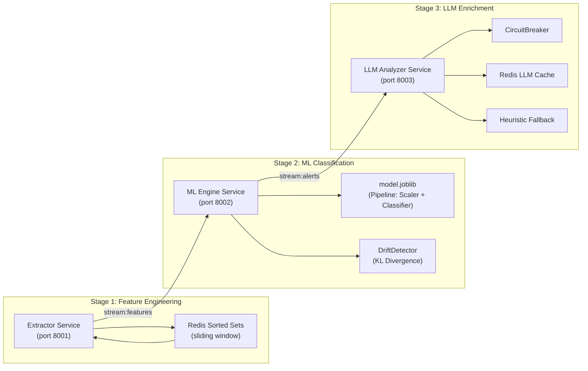
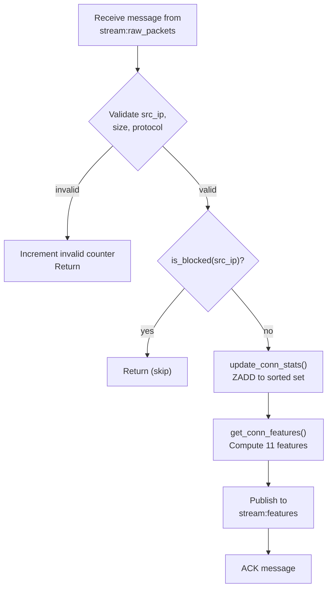
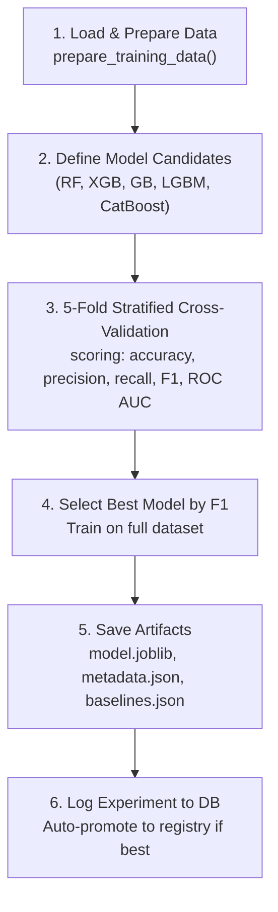
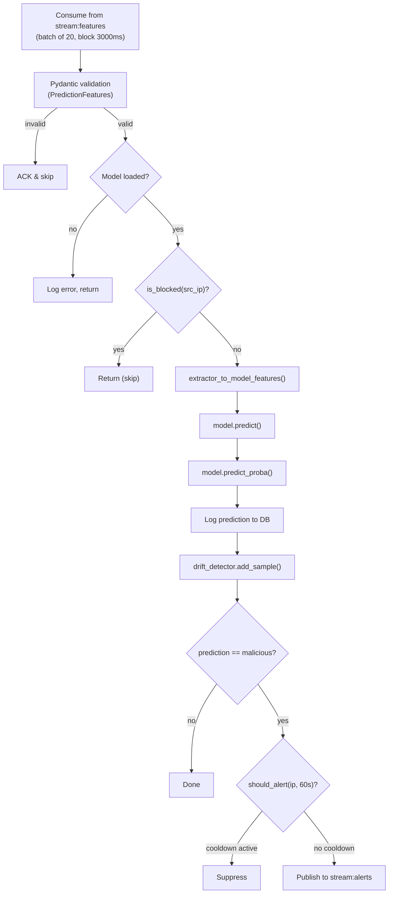
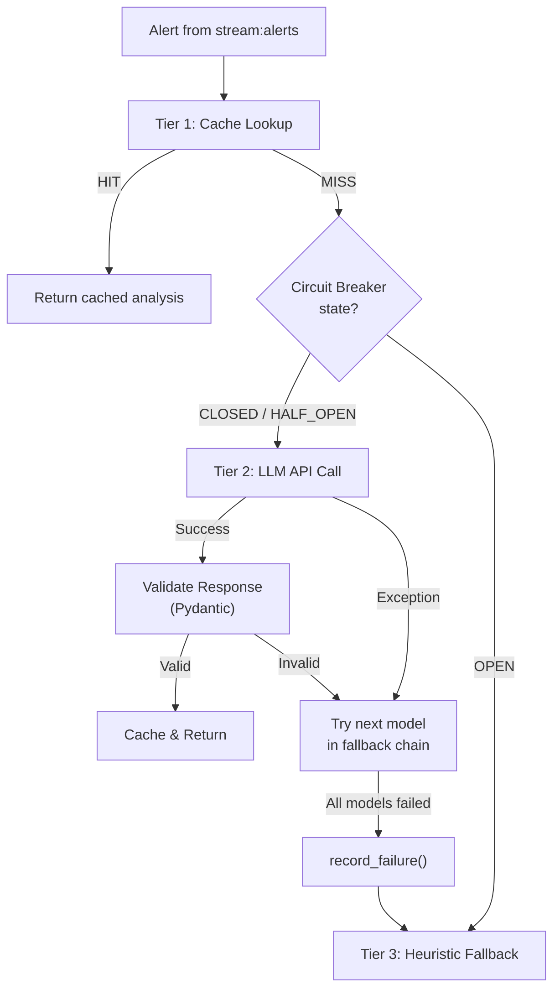
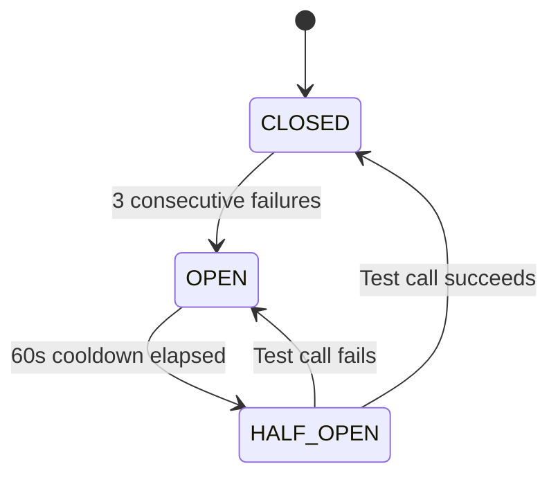
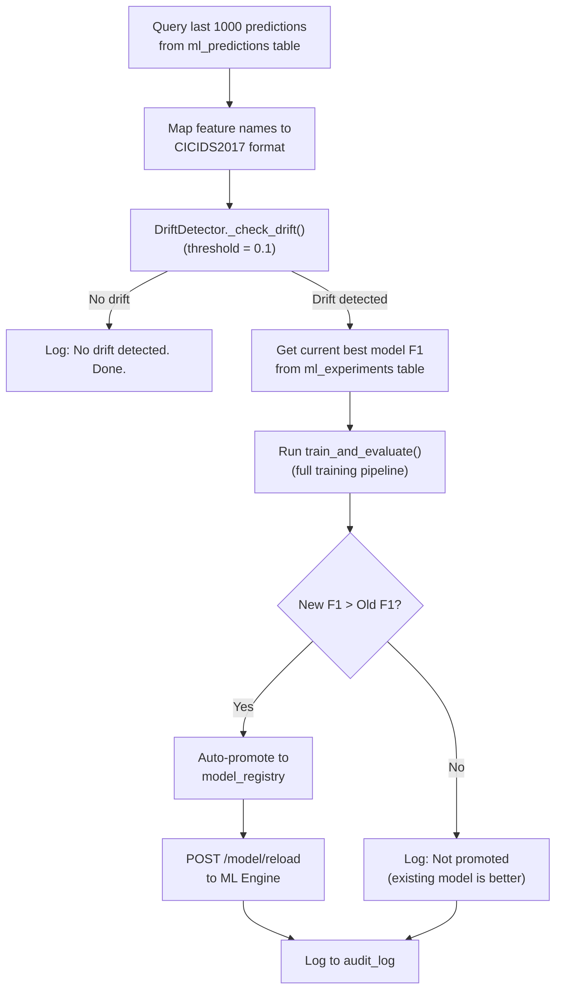
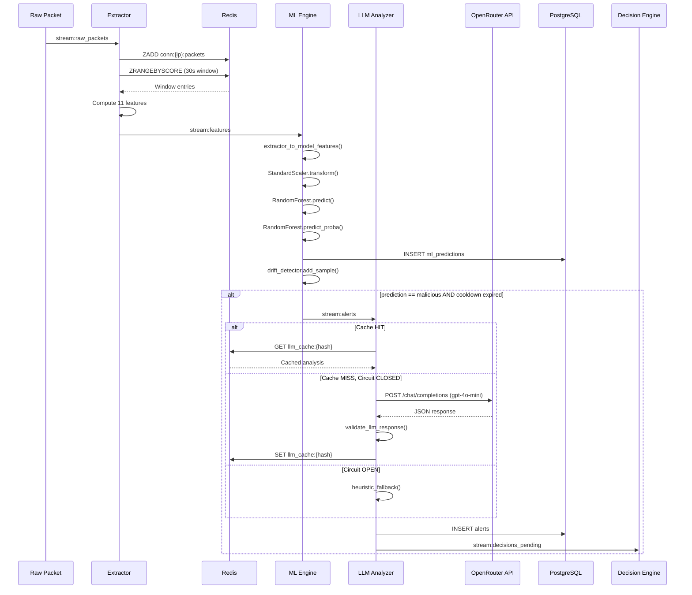
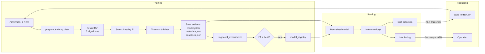

# Chapter: AI & Machine Learning Subsystem

## Document Metadata

| Field | Value |
|---|---|
| Subsystem | AI / Machine Learning |
| Version | 2.0.0 |
| Services Covered | Extractor, ML Engine, LLM Analyzer |
| Shared Modules | `drift_detector`, `circuit_breaker`, `llm_config`, `redis_client` (feature computation) |
| Primary Author | AI Engineering Team |

---

## 1. Overview

### 1.1 Purpose

The AI subsystem is responsible for the automated detection, classification, and explanation of network-based cyber threats in real time. It transforms raw network packets into actionable security intelligence through a three-stage pipeline:

1. **Feature Engineering** — Computes behavioral statistics from raw packet streams using sliding-window analysis.
2. **ML Classification** — Applies a trained binary classifier to determine whether a traffic pattern is benign or malicious.
3. **LLM Enrichment** — Generates human-readable threat explanations, attack type labels, severity assessments, and mitigation recommendations using a large language model.

### 1.2 Design Principles

| Principle | Implementation |
|---|---|
| **Separation of Concerns** | Fast/cheap ML model handles high-throughput binary filtering; slow/expensive LLM handles rare-case enrichment |
| **Fail-Secure** | If any AI component fails, the system defaults to blocking (never allowing) suspicious traffic |
| **Zero Single Point of Failure** | LLM has a three-tier fallback chain (cache → API → heuristic rules); ML model hot-reloads without downtime |
| **Cost Optimization** | Alert cooldown (1 per IP per 60s), traffic-profile caching, and circuit breakers minimize external API spend |
| **Observability** | Every prediction, LLM call, drift event, and latency metric is tracked via Prometheus and PostgreSQL |

### 1.3 Component Map



---

## 2. Feature Engineering

### 2.1 Overview

The Feature Engineering stage converts raw packet metadata `(src_ip, size, protocol)` into an 11-dimensional numeric feature vector that characterizes the behavioral profile of a source IP address over a configurable time window.

**Service:** [extractor/main.py](file:///d:/final-soc/CypherGuard/extractor/main.py)  
**Feature Computation:** [shared/redis_client.py → get_conn_features()](file:///d:/final-soc/CypherGuard/shared/redis_client.py#L175-L248)  
**Feature Definitions:** [ml_engine/feature_engineering.py → FEATURE_COLUMNS](file:///d:/final-soc/CypherGuard/ml_engine/feature_engineering.py#L26-L38)

### 2.2 Sliding Window Architecture

Each source IP maintains a Redis Sorted Set that functions as a time-ordered sliding window of packet observations.

**Redis Key Format:**
```
t:{tenant_id}:conn:{src_ip}:packets
```

**Entry Format:**
```
Member: "{timestamp_ms}:{packet_size_bytes}"
Score:  {timestamp_ms}
```

**Window Operations:**

| Operation | Redis Command | Purpose |
|---|---|---|
| Add packet | `ZADD key {timestamp_ms} "{timestamp_ms}:{size}"` | Record new observation |
| Trim by time | `ZREMRANGEBYSCORE key 0 (now_ms - window_ms)` | Remove packets older than window |
| Trim by count | `ZREMRANGEBYRANK key 0 -10001` | Cap at 10,000 entries (DDoS protection) |
| Set expiry | `EXPIRE key (ttl + 60)` | Auto-cleanup after inactivity |
| Query window | `ZRANGEBYSCORE key (now_ms - window_ms) now_ms` | Retrieve all packets in window |

All five operations are executed atomically in a Redis pipeline to minimize round-trips:

```python
pipe = self.client.pipeline()
pipe.zadd(key, {member: now_ms})
pipe.zremrangebyscore(key, 0, now_ms - (ttl * 1000))
pipe.zremrangebyrank(key, 0, -10001)
pipe.expire(key, ttl + 60)
await pipe.execute()
```

**Configuration:**

| Parameter | Default | Environment Variable | Description |
|---|---|---|---|
| Window duration | 30 seconds | `FEATURE_WINDOW_SECONDS` | Time span for feature computation |
| TTL | 300 seconds | — | How long Redis keeps data for an inactive IP |
| Max entries per IP | 10,000 | — | Hard cap to prevent memory exhaustion under DDoS |

### 2.3 Feature Definitions

The following 11 features are computed for every source IP at every packet arrival. They are defined in [FEATURE_COLUMNS](file:///d:/final-soc/CypherGuard/ml_engine/feature_engineering.py#L26-L38) and mapped from runtime names via [EXTRACTOR_TO_CICIDS](file:///d:/final-soc/CypherGuard/ml_engine/feature_engineering.py#L41-L53).

Let *n* be the number of packets in the window, *s = {s₁, s₂, …, sₙ}* be the packet sizes, and *t = {t₁, t₂, …, tₙ}* be the timestamps (sorted ascending).

#### 2.3.1 Flow Bytes/s

| Property | Value |
|---|---|
| CICIDS2017 Name | `Flow Bytes/s` |
| Runtime Name | `bytes_per_sec` |
| Formula | `Σsᵢ / W` where `W` = window duration in seconds |
| Range | [0, ∞) — capped at 10⁸ during serving |
| Security Relevance | DDoS volumetric floods produce extremely high byte rates |

#### 2.3.2 Flow Packets/s

| Property | Value |
|---|---|
| CICIDS2017 Name | `Flow Packets/s` |
| Runtime Name | `packets_per_sec` |
| Formula | `n / W` |
| Range | [0, ∞) — capped at 10⁸ during serving |
| Security Relevance | Port scans and SYN floods produce high packet rates with small payloads |

#### 2.3.3 Avg Packet Size

| Property | Value |
|---|---|
| CICIDS2017 Name | `Avg Packet Size` |
| Runtime Name | `avg_packet_size` |
| Formula | `(Σsᵢ) / n` |
| Range | [0, 65535] |
| Security Relevance | SYN/ACK probes: ~40-60 bytes. DDoS floods: ~1400 bytes. Normal browsing: ~200-800 bytes |

#### 2.3.4 Flow Duration

| Property | Value |
|---|---|
| CICIDS2017 Name | `Flow Duration` |
| Runtime Name | `flow_duration` |
| Formula | `(max(t) - min(t)) / 1000` (seconds) |
| Range | [0, 86400] — capped at 1 day during serving |
| Security Relevance | Scans are bursty (short duration); normal sessions are sustained |

#### 2.3.5 Total Fwd Packets

| Property | Value |
|---|---|
| CICIDS2017 Name | `Total Fwd Packets` |
| Runtime Name | `packet_count` |
| Formula | `n` (count of packets in window) |
| Range | [0, 10000] (bounded by max entries cap) |
| Security Relevance | Raw volume indicator for traffic intensity |

#### 2.3.6 Total Length of Fwd Packets

| Property | Value |
|---|---|
| CICIDS2017 Name | `Total Length of Fwd Packets` |
| Runtime Name | `total_bytes` |
| Formula | `Σsᵢ` |
| Range | [0, ∞) — capped at 10⁸ during serving |
| Security Relevance | Bandwidth consumption measurement |

#### 2.3.7 Fwd Packet Length Mean

| Property | Value |
|---|---|
| CICIDS2017 Name | `Fwd Packet Length Mean` |
| Runtime Name | `fwd_pkt_len_mean` |
| Formula | `μₛ = (1/n) × Σsᵢ` |
| Range | [0, ∞) — non-negative enforced during serving |
| Note | Equivalent to Avg Packet Size in this system (forward-only traffic) |

#### 2.3.8 Fwd Packet Length Std

| Property | Value |
|---|---|
| CICIDS2017 Name | `Fwd Packet Length Std` |
| Runtime Name | `fwd_pkt_len_std` |
| Formula | `σₛ = √((1/n) × Σ(sᵢ - μₛ)²)` |
| Range | [0, ∞) |
| Security Relevance | σ ≈ 0 indicates uniform traffic (automated tool/bot); large σ indicates varied traffic (human) |

#### 2.3.9 Flow IAT Mean

| Property | Value |
|---|---|
| CICIDS2017 Name | `Flow IAT Mean` |
| Runtime Name | `flow_iat_mean` |
| Formula | Given sorted timestamps, IAT = inter-arrival times: `IATᵢ = tᵢ₊₁ - tᵢ`. Mean = `(1/(n-1)) × Σ IATᵢ` |
| Range | [0, ∞) |
| Security Relevance | Automated attacks have IAT mean near zero (microseconds); human traffic has IAT in seconds |

#### 2.3.10 Flow IAT Std

| Property | Value |
|---|---|
| CICIDS2017 Name | `Flow IAT Std` |
| Runtime Name | `flow_iat_std` |
| Formula | `σ_IAT = √((1/(n-1)) × Σ(IATᵢ - μ_IAT)²)` |
| Range | [0, ∞) |
| Security Relevance | Low standard deviation = robotic regularity (scanner/bot); high = human-like irregularity |

#### 2.3.11 Small Packet Ratio

| Property | Value |
|---|---|
| CICIDS2017 Name | `Small Packet Ratio` |
| Runtime Name | `small_packet_ratio` |
| Formula | `|{sᵢ : sᵢ < 100}| / n` |
| Range | [0, 1] — clamped during serving |
| Security Relevance | Port scans consist almost entirely of small packets (ratio > 0.8). DDoS has very low ratio (< 0.1) |

### 2.4 Feature Name Mapping

The extractor produces features using runtime names (e.g., `packets_per_sec`). The ML model expects CICIDS2017 column names (e.g., `Flow Packets/s`). The mapping is defined in [EXTRACTOR_TO_CICIDS](file:///d:/final-soc/CypherGuard/ml_engine/feature_engineering.py#L41-L53) and applied by [extractor_to_model_features()](file:///d:/final-soc/CypherGuard/ml_engine/feature_engineering.py#L120-L161).

```python
EXTRACTOR_TO_CICIDS = {
    "bytes_per_sec":       "Flow Bytes/s",
    "packets_per_sec":     "Flow Packets/s",
    "avg_packet_size":     "Avg Packet Size",
    "flow_duration":       "Flow Duration",
    "packet_count":        "Total Fwd Packets",
    "total_bytes":         "Total Length of Fwd Packets",
    "fwd_pkt_len_mean":    "Fwd Packet Length Mean",
    "fwd_pkt_len_std":     "Fwd Packet Length Std",
    "flow_iat_mean":       "Flow IAT Mean",
    "flow_iat_std":        "Flow IAT Std",
    "small_packet_ratio":  "Small Packet Ratio",
}
```

### 2.5 Serving-Time Sanitization

The [extractor_to_model_features()](file:///d:/final-soc/CypherGuard/ml_engine/feature_engineering.py#L120-L161) function applies the following sanitization before model input:

| Rule | Features Affected | Constraint |
|---|---|---|
| NaN / Inf → 0.0 | All features | Prevents undefined model behavior |
| Small Packet Ratio clamp | `Small Packet Ratio` | Clamped to [0.0, 1.0] |
| Rate cap | `Flow Bytes/s`, `Flow Packets/s`, `Total Length of Fwd Packets` | Capped at 10⁸ |
| Duration cap | `Flow Duration` | Capped at 86,400 seconds (24 hours) |
| Non-negative enforcement | All remaining features | `max(0.0, value)` |

### 2.6 Extractor Processing Pipeline

**Function:** [process_packet()](file:///d:/final-soc/CypherGuard/extractor/main.py#L59-L118)



**Background Tasks:**

| Task | Function | Interval | Purpose |
|---|---|---|---|
| Consumer loop | `consumer_loop()` | Continuous (batch=50, block=2000ms) | Main packet processing |
| Metrics publisher | `metrics_publisher_loop()` | Every 1 second | Aggregates pps/bps/active connections for dashboard |

---

## 3. ML Classification

### 3.1 Overview

The ML Engine performs binary classification (benign vs. malicious) on the 11-dimensional feature vectors produced by the Extractor.

**Service:** [ml_engine/main.py](file:///d:/final-soc/CypherGuard/ml_engine/main.py)  
**Feature Engineering:** [ml_engine/feature_engineering.py](file:///d:/final-soc/CypherGuard/ml_engine/feature_engineering.py)  
**Training Pipeline:** [ml_engine/train_production.py](file:///d:/final-soc/CypherGuard/ml_engine/train_production.py)

### 3.2 Model Architecture

The production model is a scikit-learn `Pipeline` consisting of two stages:

```
Input (11 features) → StandardScaler → Classifier → Output (0 or 1)
```

**Stage 1 — StandardScaler:**

Standardizes features using z-score normalization:

```
z = (x - μ) / σ
```

Where μ and σ are computed from the training data and stored inside the Pipeline object. This ensures the same transformation is applied at training time and serving time.

**Stage 2 — Classifier:**

One of the following algorithms, selected automatically by the training pipeline based on F1 score:

| Algorithm | Library | Key Hyperparameters |
|---|---|---|
| RandomForestClassifier | scikit-learn | `n_estimators=100`, `max_depth=20`, `class_weight="balanced"` |
| XGBClassifier | xgboost | `n_estimators=100`, `max_depth=8`, `scale_pos_weight=auto` |
| GradientBoostingClassifier | scikit-learn | `n_estimators=100`, `max_depth=5` |
| LGBMClassifier | lightgbm | `n_estimators=100`, `max_depth=7`, `scale_pos_weight=auto` |
| CatBoostClassifier | catboost | `n_estimators=100`, `max_depth=6`, `auto_class_weights="Balanced"` |

### 3.3 Training Dataset

**Dataset:** CICIDS2017 (Canadian Institute for Cybersecurity Intrusion Detection Systems 2017)  
**Source:** University of New Brunswick  
**URL:** https://www.unb.ca/cic/datasets/ids-2017.html

**Dataset Structure:**

| Column | Type | Description |
|---|---|---|
| Flow Bytes/s | float | Bytes per second for the flow |
| Flow Packets/s | float | Packets per second for the flow |
| Avg Packet Size | float | Mean packet size in bytes |
| ... (8 more) | float | See Section 2.3 |
| Label | string | `BENIGN`, `DDoS`, `PortScan`, `Bot`, etc. |

**Label Encoding:**

All non-BENIGN labels are collapsed into a single `malicious` class:

```python
y = df["Label"].apply(lambda label: 0 if label.strip() == "BENIGN" else 1)
```

| Class | Label | Meaning |
|---|---|---|
| 0 | Benign | Normal network traffic |
| 1 | Malicious | Any attack type (DDoS, PortScan, BruteForce, Bot, etc.) |

**Data Cleaning (in [prepare_training_data()](file:///d:/final-soc/CypherGuard/ml_engine/feature_engineering.py#L60-L113)):**

1. Column names stripped of whitespace (CICIDS2017 data quality issue)
2. Infinity values replaced with NaN
3. Rows with NaN in feature columns or Label dropped
4. Missing features (if any) filled with 0.0
5. Column order enforced to match `FEATURE_COLUMNS` exactly

### 3.4 Training Pipeline

**Script:** [ml_engine/train_production.py](file:///d:/final-soc/CypherGuard/ml_engine/train_production.py)  
**Usage:** `python ml_engine/train_production.py [path_to_csv]`

#### 3.4.1 Pipeline Stages



#### 3.4.2 Cross-Validation

```python
cv = StratifiedKFold(n_splits=5, shuffle=True, random_state=42)
```

- **Stratified:** Preserves the benign/malicious class ratio in each fold
- **5 folds:** Each fold uses 80% data for training and 20% for validation
- **Metrics evaluated per fold:** Accuracy, Precision, Recall, F1, ROC AUC
- **Model selection criterion:** Highest mean F1 score across folds

#### 3.4.3 Class Imbalance Handling

CICIDS2017 is imbalanced (typically 80% benign, 20% attack for DDoS files). The pipeline handles this through:

- **RandomForest:** `class_weight="balanced"` — adjusts sample weights inversely proportional to class frequency
- **XGBoost/LightGBM:** `scale_pos_weight = neg_count / pos_count` — scales the gradient contribution of the minority class
- **CatBoost:** `auto_class_weights="Balanced"` — automatic rebalancing

#### 3.4.4 Output Artifacts

| File | Path | Contents |
|---|---|---|
| Model | `ml_engine/models/model.joblib` | Serialized sklearn Pipeline (StandardScaler + Classifier) |
| Metadata | `ml_engine/models/model_metadata.json` | Version, algorithm, features, metrics, CV results, timestamp |
| Baselines | `ml_engine/models/feature_baselines.json` | Per-feature histograms for drift detection |

**Metadata Schema:**

```json
{
  "version": "20260612_143000",
  "algorithm": "RandomForest",
  "features": ["Flow Bytes/s", "Flow Packets/s", ...],
  "n_features": 11,
  "n_training_samples": 225745,
  "class_distribution": {"benign": 97718, "attack": 128027},
  "full_training_metrics": {
    "accuracy": 0.9987,
    "precision": 0.9991,
    "recall": 0.9985,
    "f1": 0.9988,
    "roc_auc": 0.9999
  },
  "cross_validation": { ... },
  "trained_at": "2026-06-12T14:30:00",
  "dataset": "Friday-WorkingHours-Afternoon-DDos",
  "pipeline_steps": ["scaler", "model"]
}
```

#### 3.4.5 Experiment Logging

Every training run is logged to the `ml_experiments` PostgreSQL table:

| Column | Type | Description |
|---|---|---|
| `id` | UUID | Primary key |
| `experiment_name` | string | `{Algorithm}_{version}` |
| `algorithm` | string | Winning algorithm name |
| `hyperparameters` | JSON | All model parameters |
| `accuracy`, `precision`, `recall`, `f1_score`, `roc_auc` | float | Full-data metrics |
| `cv_scores` | JSON | Per-fold cross-validation results |
| `confusion_matrix` | JSON | `{tn, fp, fn, tp}` |
| `feature_importance` | JSON | `{feature_name: importance_score}` |
| `model_hash` | string | SHA256 of model.joblib |
| `training_time_seconds` | float | Wall-clock training time |
| `is_best` | boolean | Whether this is the best model so far |
| `promoted_to_registry` | boolean | Whether it was promoted to model_registry |

**Auto-Promotion Logic:**

If the new model's F1 score exceeds the current best experiment's F1 score:
1. A new `model_registry` entry is created with `is_active=True`
2. All previous registry entries are set to `is_active=False`
3. The experiment is marked `promoted_to_registry=True`

### 3.5 Inference Pipeline

**Function:** [process_features()](file:///d:/final-soc/CypherGuard/ml_engine/main.py#L158-L268)

#### 3.5.1 Processing Flow



#### 3.5.2 Prediction Output

| Output | Type | Description |
|---|---|---|
| `prediction` | int | `0` (benign) or `1` (malicious) |
| `confidence` | float | `max(predict_proba())` — highest class probability |
| `latency_ms` | float | Wall-clock inference time in milliseconds |
| `status` | string | `"benign"` or `"malicious"` |

#### 3.5.3 Confidence Score Computation

```python
proba = model.predict_proba(features_df)[0]  # e.g., [0.06, 0.94]
confidence = float(max(proba))                # e.g., 0.94
```

For a Random Forest with *T* trees, each tree votes independently. The probability is the fraction of trees voting for each class:

```
P(class=k) = (number of trees voting for k) / T
```

The confidence score is `max(P(class=0), P(class=1))`, representing how certain the ensemble is about its prediction.

#### 3.5.4 Alert Cooldown

**Mechanism:** Redis atomic `SET key NX EX` operation

```python
result = await self.client.set(f"cooldown:{ip}", "1", nx=True, ex=cooldown_seconds)
return result is not None
```

| Flag | Meaning |
|---|---|
| `NX` | Set only if the key does **not** exist |
| `EX 60` | Auto-expire after 60 seconds |

**Behavior:**
- First call for an IP → key is created → returns `True` (allow alert)
- Subsequent calls within 60 seconds → key exists → returns `False` (suppress)
- After 60 seconds → key expires → next call creates it again

**Purpose:** Prevents a single attacking IP from generating more than one LLM analysis per minute. Without this, a DDoS at 5,000 pps would trigger 5,000 LLM calls per minute.

#### 3.5.5 Prediction Logging

Every prediction is persisted to the `ml_predictions` table:

```python
record = MLPrediction(
    src_ip=src_ip,
    features=features,          # Original feature dict
    prediction=prediction,      # "benign" or "malicious"
    confidence=confidence,      # 0.0 to 1.0
    model_version=MODEL_VERSION,
    latency_ms=latency_ms,
    tenant_id=tenant_id,
)
```

This data is used by the monitoring and auto-retrain subsystems to track model performance over time.

### 3.6 Model Hot-Reloading

The ML Engine supports zero-downtime model updates through two mechanisms:

#### 3.6.1 File Watcher (Automatic)

**Function:** [model_watcher_loop()](file:///d:/final-soc/CypherGuard/ml_engine/main.py#L101-L108)

Runs every 5 seconds and checks the model file's modification time:

```python
async def model_watcher_loop():
    while True:
        load_model_if_changed()
        await asyncio.sleep(5)
```

**Reload logic in [load_model_if_changed()](file:///d:/final-soc/CypherGuard/ml_engine/main.py#L66-L96):**

1. Check `os.path.getmtime(MODEL_PATH)`
2. If mtime > last recorded mtime:
   a. Load new model into a **temporary variable** (not the global)
   b. Load new metadata
   c. Only on success: swap the global `model` reference (atomic pointer swap)
   d. Update `last_model_mtime`
3. If loading fails: old model continues serving (no downtime)

#### 3.6.2 HTTP Endpoint (Manual)

**Endpoint:** `POST /model/reload`

```python
@app.post("/model/reload")
async def reload_model():
    new_hash = _compute_model_hash(MODEL_PATH)
    if new_hash == MODEL_HASH:
        return {"status": "unchanged"}
    model = joblib.load(MODEL_PATH)
    ...
    return {"status": "reloaded", "version": MODEL_VERSION}
```

Uses SHA256 hash comparison to verify the file actually changed before incurring the cost of loading.

### 3.7 Demo Model

**Script:** [ml_engine/create_demo_model.py](file:///d:/final-soc/CypherGuard/ml_engine/create_demo_model.py)

For demonstration purposes without the CICIDS2017 dataset, a synthetic model can be generated:

```bash
python ml_engine/create_demo_model.py
```

**Synthetic data generation:**

| Feature | Benign Distribution | Attack Distribution |
|---|---|---|
| Flow Bytes/s | Lognormal(μ=7, σ=1.5) clipped [10, 50000] | Lognormal(μ=10, σ=1.5) clipped [5000, 10⁷] |
| Flow Packets/s | Lognormal(μ=0.5, σ=0.8) clipped [0.1, 10] | Lognormal(μ=2.5, σ=1) clipped [5, 5000] |
| Flow IAT Mean | Exponential(λ=2) | Exponential(λ=0.05) |
| Small Packet Ratio | Beta(α=2, β=5) | Beta(α=5, β=2) |
| ... | ... | ... |

Sample sizes: 5,000 benign + 3,000 attack = 8,000 total.

---

## 4. LLM Enrichment

### 4.1 Overview

The LLM Analyzer produces structured threat intelligence for every alert flagged by the ML Engine. It outputs four fields:

| Field | Type | Description | Example |
|---|---|---|---|
| `attack_type` | string | Classification of the attack | "DDoS Volumetric Flood" |
| `severity` | enum | `low`, `medium`, `high`, `critical` | "critical" |
| `explanation` | string | 1-2 sentence description of what was detected | "High-rate volumetric flow at 5200 pkt/s..." |
| `recommendation` | string | 1 actionable mitigation step | "Deploy network-level rate limiting..." |

**Service:** [llm_analyzer/main.py](file:///d:/final-soc/CypherGuard/llm_analyzer/main.py)  
**Prompt Configuration:** [shared/llm_config.py](file:///d:/final-soc/CypherGuard/shared/llm_config.py)  
**Circuit Breaker:** [shared/circuit_breaker.py](file:///d:/final-soc/CypherGuard/shared/circuit_breaker.py)

### 4.2 Three-Tier Analysis Architecture



### 4.3 Tier 1: Traffic Profile Cache

**Function:** [_cache_key()](file:///d:/final-soc/CypherGuard/llm_analyzer/main.py#L86-L103)

Traffic profiles are bucketed to increase cache hit rate. Similar attack patterns map to the same cache entry:

**Bucketing Rules:**

| Feature | Bucket Size | Example: value 5200 → bucket |
|---|---|---|
| `packets_per_sec` | 500 | 5000 |
| `bytes_per_sec` | 50,000 | 50000 (if bps=78000) |
| `avg_packet_size` | 200 | 1200 (if size=1380) |

**Cache Key Construction:**

```python
raw = f"{pps_bucket}:{bps_bucket}:{size_bucket}"
key = f"t:{tenant_id}:llm_cache:{md5(raw)}"
```

**Cache Configuration:**

| Parameter | Default | Environment Variable |
|---|---|---|
| Cache TTL | 3600 seconds (1 hour) | `LLM_CACHE_TTL` |

### 4.4 Tier 2: LLM API

#### 4.4.1 Provider

**API:** OpenRouter (https://openrouter.ai/api/v1)  
**Client Library:** `openai.AsyncOpenAI` (OpenAI-compatible SDK)  
**Authentication:** `OPENROUTER_API_KEY` environment variable

#### 4.4.2 Model Fallback Chain

Defined in [MODEL_FALLBACK_CHAIN](file:///d:/final-soc/CypherGuard/shared/llm_config.py#L157-L160):

| Attempt | Model | Cost Tier |
|---|---|---|
| 1 (Primary) | `openai/gpt-4o-mini` | Low |
| 2 (Fallback) | `meta-llama/llama-3-8b-instruct:free` | Free |

If attempt 1 fails or returns an invalid response, attempt 2 is tried before falling back to heuristics.

#### 4.4.3 Prompt Engineering

**Prompt Version:** `v2` (defined in [shared/llm_config.py](file:///d:/final-soc/CypherGuard/shared/llm_config.py))

**System Prompt:**

```
You are a senior SOC analyst for an Intrusion Detection System. Analyze the
network traffic alert below and classify the threat.

RULES:
1. Respond ONLY with valid JSON — no markdown, no explanation outside JSON.
2. severity MUST be one of: low, medium, high, critical
3. explanation must be 1-2 sentences maximum
4. recommendation must be 1 actionable sentence

OUTPUT FORMAT:
{"attack_type":"string","severity":"low|medium|high|critical",
 "explanation":"string","recommendation":"string"}
```

**User Prompt (template):**

```
ALERT — Source IP: {src_ip}
Packets/sec: {pps:.1f} | Bytes/sec: {bps:.1f}
Avg Packet Size: {avg_size:.0f}B | ML Confidence: {confidence:.1%}
Classify this traffic pattern.
```

**API Parameters:**

| Parameter | Value | Rationale |
|---|---|---|
| `temperature` | 0.1 | Near-deterministic output for consistent classifications |
| `max_tokens` | 200 | Expected output is ~80 tokens; 200 provides headroom with cost control |
| `timeout` | 15 seconds | `LLM_TIMEOUT` environment variable |

#### 4.4.4 Response Validation

**Schema ([LLMAnalysisResponse](file:///d:/final-soc/CypherGuard/shared/llm_config.py#L109-L114)):**

```python
class LLMAnalysisResponse(BaseModel):
    attack_type: str = Field(..., min_length=1, max_length=100)
    severity: str = Field(..., pattern="^(low|medium|high|critical)$")
    explanation: str = Field(..., min_length=1, max_length=500)
    recommendation: str = Field(..., min_length=1, max_length=500)
```

**Preprocessing before validation ([validate_llm_response()](file:///d:/final-soc/CypherGuard/shared/llm_config.py#L125-L150)):**

1. Strip leading/trailing whitespace
2. If response starts with ` ``` `, extract content between the code fence markers
3. If content starts with `json`, strip the language identifier
4. Parse as JSON
5. Validate against Pydantic schema
6. Return validated dict or `None` if invalid

### 4.5 Tier 3: Heuristic Fallback

**Function:** [heuristic_fallback()](file:///d:/final-soc/CypherGuard/llm_analyzer/main.py#L127-L189)

When the LLM is unavailable (circuit open or all models failed), a rule-based classifier provides deterministic fallback:

| Condition | Attack Type | Severity |
|---|---|---|
| `avg_size > 1000 AND pps > 1000` | DDoS Volumetric Flood | critical |
| `small_pkt_ratio > 0.8 AND pps > 1500` | SYN Flood / Port Scan | high |
| `avg_size < 100 AND pps > 1000` | Fast Port Scan | high |
| `200 < avg_size < 600 AND pps > 100` | Brute Force Attack | medium |
| `pps > 500` | Anomalous High-Rate Traffic | high |
| Default | Suspicious Traffic Pattern | medium |

Each classification includes a tailored explanation and recommendation string.

### 4.6 Circuit Breaker

**Class:** [CircuitBreaker](file:///d:/final-soc/CypherGuard/shared/circuit_breaker.py#L44-L135)  
**Instance:** `llm_circuit = CircuitBreaker(name="openrouter", failure_threshold=3, recovery_timeout=60)`

#### 4.6.1 State Machine



#### 4.6.2 Configuration

| Parameter | Value | Description |
|---|---|---|
| `failure_threshold` | 3 | Consecutive failures before opening circuit |
| `recovery_timeout` | 60 seconds | Time in OPEN state before allowing a test call |

#### 4.6.3 Metrics

The circuit breaker exposes statistics via `get_stats()`:

| Metric | Description |
|---|---|
| `state` | Current state (`closed`, `open`, `half_open`) |
| `failure_count` | Current consecutive failure count |
| `total_calls` | Lifetime total calls |
| `total_failures` | Lifetime total failures |
| `total_rejected` | Calls rejected while OPEN |

The Prometheus gauge `securenet_circuit_breaker_state` maps: closed=0, half_open=1, open=2.

### 4.7 Alert Processing Pipeline

**Function:** [process_alert_message()](file:///d:/final-soc/CypherGuard/llm_analyzer/main.py#L279-L349)

After analysis (via any of the three tiers), the following actions are performed:

1. **Prometheus metrics:** Increment `ALERTS_GENERATED` counter (labeled by attack_type and severity)
2. **PostgreSQL persistence:** Insert into `alerts` table with all fields (attack_type, severity, explanation, recommendation, raw_features, llm_response)
3. **Decision routing:** Publish to `stream:decisions_pending` with alert_id, severity, and attack_type
4. **Dashboard feed:** Push to tenant-scoped `recent_alerts` Redis list for real-time WebSocket delivery

---

## 5. Model Lifecycle Management

### 5.1 Drift Detection

**Class:** [DriftDetector](file:///d:/final-soc/CypherGuard/shared/drift_detector.py#L44-L155)

#### 5.1.1 Purpose

Detects when the statistical distribution of production features diverges from the training distribution, indicating potential model accuracy degradation.

#### 5.1.2 Algorithm

**Metric:** KL Divergence (Kullback-Leibler Divergence)

For discrete probability distributions P (runtime) and Q (baseline):

```
D_KL(P || Q) = Σᵢ P(i) × log(P(i) / Q(i))
```

**Properties:**
- D_KL ≥ 0 (always non-negative)
- D_KL = 0 if and only if P = Q
- D_KL is **not symmetric**: D_KL(P||Q) ≠ D_KL(Q||P)

#### 5.1.3 Implementation Details

**Baseline Computation (training time):**

```python
hist, bin_edges = np.histogram(values, bins=20, density=True)
```

For each feature, a 20-bin normalized histogram is computed from the training data and saved to `feature_baselines.json`.

**Runtime Comparison:**

```python
runtime_hist, _ = np.histogram(runtime_values, bins=bin_edges, density=True)

# Laplace smoothing (prevents log(0) = -inf)
runtime_hist = runtime_hist + 1e-10
baseline_hist = baseline_hist + 1e-10

# Normalize to probability distributions
runtime_hist = runtime_hist / runtime_hist.sum()
baseline_hist = baseline_hist / baseline_hist.sum()

kl_div = entropy(runtime_hist, baseline_hist)  # scipy.stats.entropy
```

**Laplace Smoothing:** Adding 1e-10 to all bins prevents division by zero when a bin has zero count in either distribution. The constant is small enough to have negligible impact on the divergence value.

#### 5.1.4 Configuration

| Parameter | Default | Description |
|---|---|---|
| `window_size` | 1000 | Number of samples to buffer before checking drift |
| `kl_threshold` | 0.5 (inline) / 0.1 (auto-retrain) | KL divergence threshold for triggering alert |
| `n_bins` | 20 | Number of histogram bins |

#### 5.1.5 Drift Event Output

```python
{
    "feature": "Flow Bytes/s",
    "kl_divergence": 0.7234,
    "threshold": 0.5,
    "samples": 1000
}
```

### 5.2 Live Model Monitoring

**Module:** [ml_engine/model_monitoring.py](file:///d:/final-soc/CypherGuard/ml_engine/model_monitoring.py)

**Execution:** Background task inside ML Engine, runs every 60 seconds (configurable via `MODEL_MONITOR_INTERVAL_SECONDS`).

#### 5.2.1 Monitoring Cycle

| Step | Data Source | Computation |
|---|---|---|
| 1. Fetch predictions | `ml_predictions` table (last 1000) | — |
| 2. P95 latency | `latency_ms` column | `numpy.percentile(latencies, 95)` |
| 3. Fetch ground truth | `alerts` table (same time range) | Match by `src_ip` within 15-second window |
| 4. Confusion matrix | Predictions vs. alert status | See below |
| 5. Compute metrics | TP, FP, TN, FN | Accuracy, Precision, Recall, F1 |
| 6. Compute drift | Features from predictions | Max KL divergence across all features |
| 7. Publish to Prometheus | Gauges | `MODEL_ACCURACY_RECENT`, `MODEL_F1_RECENT`, `MODEL_LATENCY_P95`, `PREDICTION_DRIFT_SCORE` |
| 8. Degradation alert | — | If accuracy < 95% or p95 latency > 500ms |

#### 5.2.2 Ground Truth Matching Logic

```python
for prediction in predictions:
    if prediction.prediction == "malicious":
        if matching_alert and matching_alert.status == "false_positive":
            FP += 1   # Model said attack, analyst said false alarm
        else:
            TP += 1   # Model said attack, confirmed real
    else:  # benign
        if matching_alert and matching_alert.status not in ("false_positive", "new"):
            FN += 1   # Model said benign, but real attack existed
        else:
            TN += 1   # Model said benign, actually benign
```

### 5.3 Automated Retraining

**Module:** [ml_engine/auto_retrain.py](file:///d:/final-soc/CypherGuard/ml_engine/auto_retrain.py)

#### 5.3.1 Invocation Modes

```bash
python ml_engine/auto_retrain.py --check-drift    # One-shot: check + retrain if needed
python ml_engine/auto_retrain.py --force-retrain   # Force retrain immediately
python ml_engine/auto_retrain.py --daemon          # Daemon: check every 1 hour
python ml_engine/auto_retrain.py --csv /path.csv   # Specify training data
```

#### 5.3.2 Drift-Triggered Retrain Flow



#### 5.3.3 Multi-Tenant Safety

Auto-retrain operates at the platform level (not per-tenant) because:
1. The ML model is shared infrastructure serving all tenants
2. Drift detection requires cross-tenant data for statistical significance
3. No per-tenant data is exposed — only aggregated feature statistics

---

## 6. Configuration Reference

### 6.1 Environment Variables

| Variable | Service | Default | Description |
|---|---|---|---|
| `FEATURE_WINDOW_SECONDS` | Extractor | `30` | Sliding window duration for feature computation |
| `METRICS_PUBLISH_INTERVAL` | Extractor | `1.0` | Dashboard metrics refresh interval (seconds) |
| `MODEL_PATH` | ML Engine | `ml_engine/models/model.joblib` | Path to serialized model |
| `MODEL_METADATA_PATH` | ML Engine | `ml_engine/models/model_metadata.json` | Path to model metadata |
| `ALERT_COOLDOWN_SECONDS` | ML Engine | `60` | Minimum seconds between alerts for same IP |
| `DRIFT_BASELINE_PATH` | ML Engine | `ml_engine/models/feature_baselines.json` | Feature distribution baselines |
| `MODEL_MONITOR_INTERVAL_SECONDS` | ML Engine | `60` | Live monitoring check interval |
| `OPENROUTER_API_KEY` | LLM Analyzer | _(required)_ | OpenRouter API authentication key |
| `LLM_TIMEOUT` | LLM Analyzer | `15` | LLM API call timeout (seconds) |
| `LLM_CACHE_TTL` | LLM Analyzer | `3600` | Cache entry lifetime (seconds) |

### 6.2 Redis Keys (AI-Related)

| Key Pattern | Type | TTL | Used By |
|---|---|---|---|
| `t:{tid}:conn:{ip}:packets` | Sorted Set | 360s | Extractor (sliding window) |
| `t:{tid}:cooldown:{ip}` | String | 60s | ML Engine (alert dedup) |
| `t:{tid}:llm_cache:{hash}` | String | 3600s | LLM Analyzer (response cache) |
| `t:{tid}:live_metrics` | String | 10s | Extractor → Dashboard |
| `t:{tid}:recent_alerts` | List | None | LLM Analyzer → Dashboard |

### 6.3 Redis Streams (AI-Related)

| Stream | Producer | Consumer Group | Consumer | Batch Size |
|---|---|---|---|---|
| `stream:raw_packets` | Sniffer / Ingest Gateway | `extractor_group` | `extractor_worker_1` | 50 |
| `stream:features` | Extractor | `ml_engine_group` | `ml_worker_1` | 20 |
| `stream:alerts` | ML Engine | `llm_analyzer_group` | `llm_worker_1` | 5 |

---

## 7. API Reference (AI Services)

### 7.1 ML Engine (port 8002)

| Method | Path | Description |
|---|---|---|
| `GET` | `/health` | Service health + model loaded status |
| `GET` | `/ready` | Readiness check (Redis connectivity) |
| `GET` | `/metrics` | Prometheus-format metrics |
| `GET` | `/model/info` | Model version, features, hash, drift status |
| `POST` | `/model/reload` | Trigger hot-reload from disk |

**`GET /model/info` Response:**

```json
{
  "version": "20260612_143000",
  "path": "/app/ml_engine/models/model.joblib",
  "file_hash": "a1b2c3d4...",
  "features": ["Flow Bytes/s", "Flow Packets/s", ...],
  "drift_enabled": true,
  "drift_events": [
    {"feature": "Flow Bytes/s", "kl_divergence": 0.12, "threshold": 0.5, "samples": 1000}
  ]
}
```

### 7.2 LLM Analyzer (port 8003)

| Method | Path | Description |
|---|---|---|
| `GET` | `/health` | Service health |
| `GET` | `/ready` | Readiness check (Redis + DB connectivity) |
| `GET` | `/metrics` | Prometheus-format metrics |
| `GET` | `/api/logs` | Last 50 threat analysis logs |

### 7.3 Extractor (port 8001)

| Method | Path | Description |
|---|---|---|
| `GET` | `/health` | Service health |
| `GET` | `/ready` | Readiness check (Redis connectivity) |
| `GET` | `/metrics` | Prometheus-format metrics |
| `GET` | `/api/metrics` | Live traffic metrics (pps, bps, active connections) |

---

## 8. Prometheus Metrics

### 8.1 ML Engine Metrics

| Metric | Type | Labels | Description |
|---|---|---|---|
| `securenet_predictions_total` | Counter | `result`, `model_version` | Total predictions by result (benign/malicious) |
| `securenet_prediction_latency_seconds` | Histogram | `model_version` | Inference latency distribution |
| `securenet_model_accuracy_recent` | Gauge | — | Rolling accuracy from monitoring cycle |
| `securenet_model_f1_recent` | Gauge | — | Rolling F1 from monitoring cycle |
| `securenet_model_latency_p95` | Gauge | — | P95 inference latency (ms) |
| `securenet_prediction_drift_score` | Gauge | — | Maximum KL divergence across features |
| `securenet_feature_drift_detected_total` | Counter | `feature` | Drift events per feature |
| `securenet_stream_lag` | Gauge | `stream`, `group` | Messages pending in consumer group |

### 8.2 LLM Analyzer Metrics

| Metric | Type | Labels | Description |
|---|---|---|---|
| `securenet_llm_calls_total` | Counter | `status` | LLM calls by status: `success`, `failure`, `cache_hit`, `fallback`, `circuit_open` |
| `securenet_llm_latency_seconds` | Histogram | — | LLM API response time |
| `securenet_alerts_generated_total` | Counter | `attack_type`, `severity` | Alerts by classification |
| `securenet_circuit_breaker_state` | Gauge | `name` | Circuit state: 0=closed, 1=half_open, 2=open |

### 8.3 Extractor Metrics

| Metric | Type | Labels | Description |
|---|---|---|---|
| `securenet_packets_processed_total` | Counter | `service`, `status` | Packets processed (success/invalid) |
| `securenet_active_connections` | Gauge | — | Number of active source IPs |

---

## 9. Database Schema (AI Tables)

### 9.1 ml_predictions

| Column | Type | Nullable | Description |
|---|---|---|---|
| `id` | UUID | No | Primary key |
| `src_ip` | VARCHAR(45) | No | Source IP address |
| `features` | JSON | Yes | Raw feature dictionary |
| `prediction` | VARCHAR(20) | No | "benign" or "malicious" |
| `confidence` | FLOAT | Yes | Model confidence (0.0–1.0) |
| `model_version` | VARCHAR(50) | Yes | Model version string |
| `latency_ms` | FLOAT | Yes | Inference latency |
| `tenant_id` | UUID (FK) | Yes | Tenant reference |
| `created_at` | TIMESTAMP | No | Prediction timestamp |

### 9.2 alerts

| Column | Type | Nullable | Description |
|---|---|---|---|
| `id` | UUID | No | Primary key (used as `alert_id` downstream) |
| `src_ip` | VARCHAR(45) | No | Source IP address |
| `tenant_id` | UUID (FK) | Yes | Tenant reference |
| `attack_type` | VARCHAR(100) | Yes | LLM/heuristic classification |
| `severity` | VARCHAR(20) | Yes | low / medium / high / critical |
| `confidence` | FLOAT | Yes | ML model confidence |
| `explanation` | TEXT | Yes | LLM-generated explanation |
| `recommendation` | TEXT | Yes | LLM-generated recommendation |
| `raw_features` | JSON | Yes | Original feature values |
| `llm_response` | JSON | Yes | Full LLM/heuristic response object |
| `status` | VARCHAR(20) | No | new / investigating / resolved / false_positive |
| `analyst_notes` | TEXT | Yes | Human analyst notes |
| `created_at` | TIMESTAMP | No | Alert creation timestamp |

### 9.3 ml_experiments

| Column | Type | Description |
|---|---|---|
| `id` | UUID | Primary key |
| `experiment_name` | VARCHAR | `{Algorithm}_{version}` |
| `algorithm` | VARCHAR | RandomForest / XGBoost / etc. |
| `hyperparameters` | JSON | All model parameters |
| `dataset_name` | VARCHAR | Source CSV file name |
| `dataset_rows` | INT | Number of training samples |
| `feature_count` | INT | Number of features (11) |
| `accuracy`, `precision`, `recall`, `f1_score`, `roc_auc` | FLOAT | Evaluation metrics |
| `cv_scores` | JSON | Per-fold cross-validation results |
| `cv_mean`, `cv_std` | FLOAT | CV summary statistics |
| `confusion_matrix` | JSON | `{tn, fp, fn, tp}` |
| `feature_importance` | JSON | `{feature: importance}` |
| `model_file_path` | VARCHAR | Path to saved model |
| `model_hash` | VARCHAR | SHA256 of model file |
| `training_time_seconds` | FLOAT | Wall-clock training time |
| `is_best` | BOOLEAN | Best model by F1 at time of training |
| `promoted_to_registry` | BOOLEAN | Whether promoted to model_registry |
| `created_at` | TIMESTAMP | Training timestamp |

### 9.4 model_registry

| Column | Type | Description |
|---|---|---|
| `id` | UUID | Primary key |
| `version` | VARCHAR | Version string (`YYYYMMDD_HHMMSS`) |
| `algorithm` | VARCHAR | Winning algorithm |
| `accuracy`, `f1_score` | FLOAT | Key metrics |
| `feature_columns` | JSON | Feature list for validation |
| `training_samples` | INT | Training data size |
| `file_hash` | VARCHAR | SHA256 integrity hash |
| `is_active` | BOOLEAN | Currently serving model |
| `created_at` | TIMESTAMP | Registration timestamp |

---

## 10. Security Considerations

### 10.1 Input Validation

| Boundary | Validation | Location |
|---|---|---|
| Raw packet size | Must be integer in [1, 65535] | `extractor/main.py` |
| Protocol field | Must be TCP, UDP, ICMP, or OTHER | `extractor/main.py` |
| Feature values | NaN/Inf → 0.0, outlier clipping | `feature_engineering.py` |
| Stream messages | Pydantic schema validation (`PredictionFeatures`, `AlertData`) | `ml_engine/main.py`, `llm_analyzer/main.py` |
| LLM response | Pydantic schema + severity enum enforcement | `llm_config.py` |

### 10.2 Tenant Isolation

All AI operations are tenant-scoped:

| Component | Isolation Mechanism |
|---|---|
| Sliding window keys | Prefixed with `t:{tenant_id}:` |
| Alert cooldown keys | Prefixed with `t:{tenant_id}:` |
| LLM cache keys | Prefixed with `t:{tenant_id}:` |
| Blocked IP checks | Tenant-scoped Redis set |
| DB persistence | `tenant_id` foreign key on all tables |

### 10.3 API Key Security

| Key | Storage | Comparison Method |
|---|---|---|
| OpenRouter API key | Environment variable, never logged | Passed in HTTP header |
| Sensor API keys | PostgreSQL (bcrypt hash) | `bcrypt.checkpw()` |

### 10.4 LLM Prompt Injection Prevention

The LLM prompt is constructed entirely from numeric values (pps, bps, avg_size, confidence) and a validated IP address string. No user-supplied free text is ever included in the prompt, eliminating prompt injection risks.

---

## 11. Operational Procedures

### 11.1 Initial Model Training

```bash
# 1. Download CICIDS2017 dataset and place CSV in project root
# 2. Run training pipeline
python ml_engine/train_production.py Friday-WorkingHours-Afternoon-DDos.pcap_ISCX.csv

# 3. Verify output
ls ml_engine/models/
# model.joblib  model_metadata.json  feature_baselines.json
```

### 11.2 Demo Model (without dataset)

```bash
python ml_engine/create_demo_model.py
```

### 11.3 Manual Model Reload

```bash
# Via HTTP (while ML Engine is running)
curl -X POST http://localhost:8002/model/reload

# Via file replacement (auto-detected within 5 seconds)
cp new_model.joblib ml_engine/models/model.joblib
```

### 11.4 Check Drift Status

```bash
# One-shot check
python ml_engine/auto_retrain.py --check-drift

# View current drift via API
curl http://localhost:8002/model/info | python -m json.tool
```

### 11.5 Force Retrain

```bash
python ml_engine/auto_retrain.py --force-retrain --csv path/to/data.csv
```

### 11.6 Start Monitoring Daemon

```bash
python ml_engine/auto_retrain.py --daemon
```

---

## 12. Architecture Diagrams

### 12.1 Complete AI Data Flow



### 12.2 Model Lifecycle


