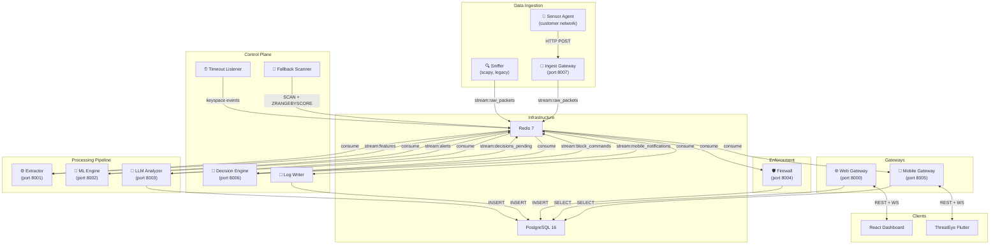
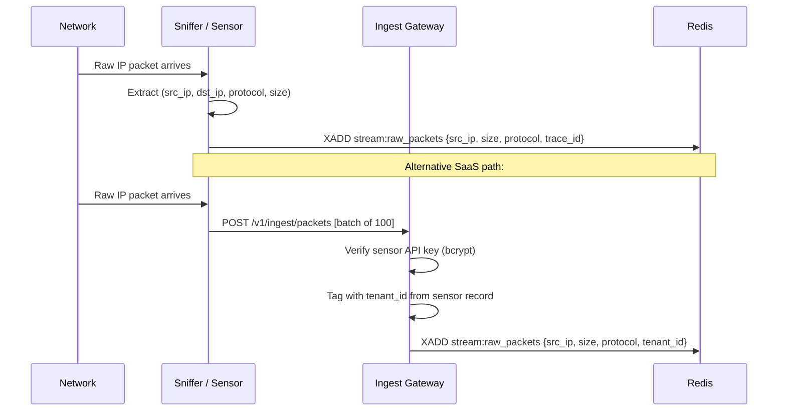
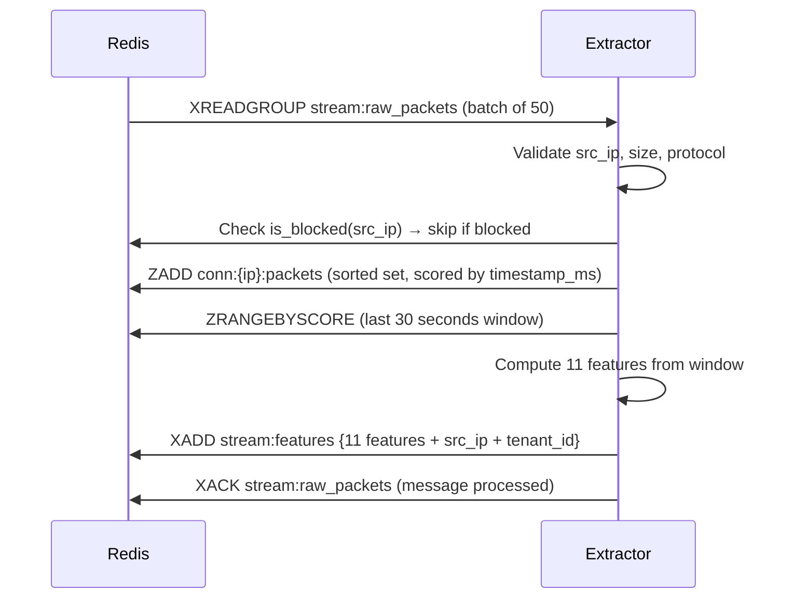
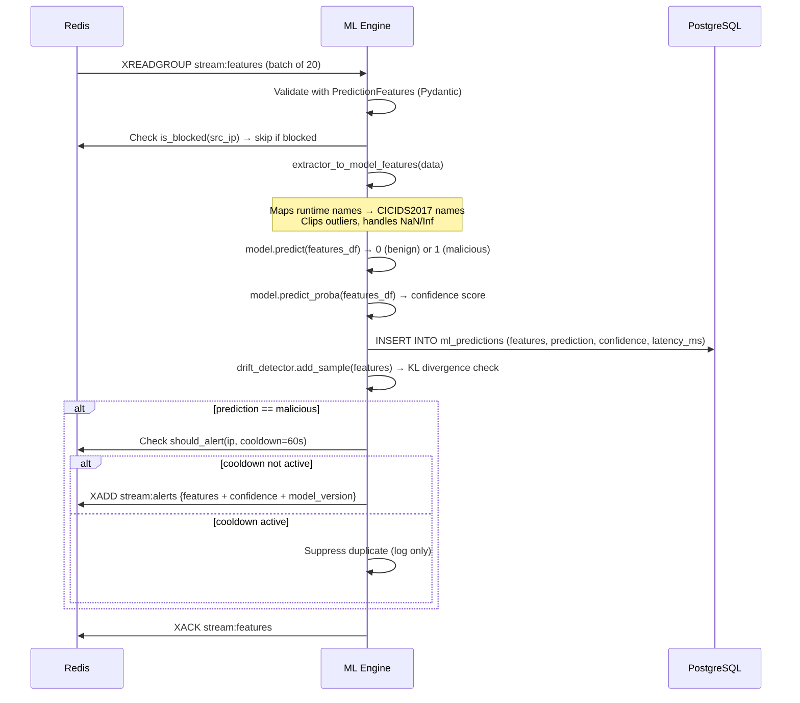
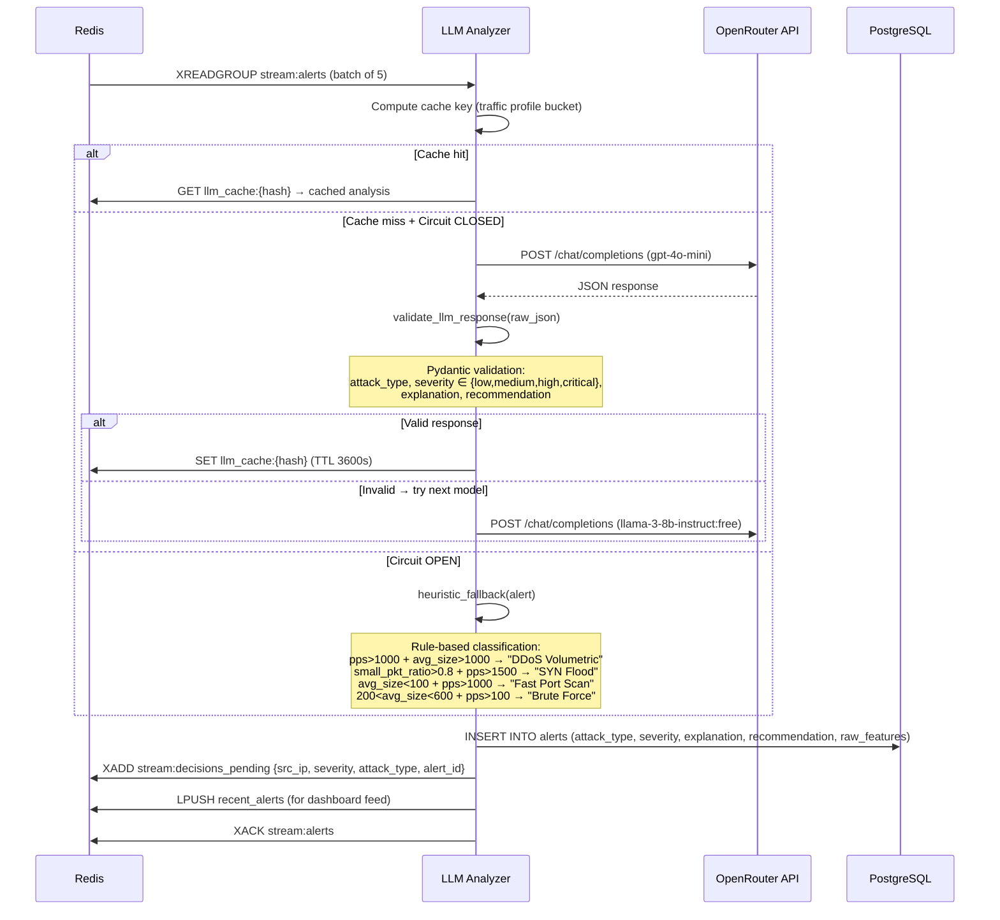
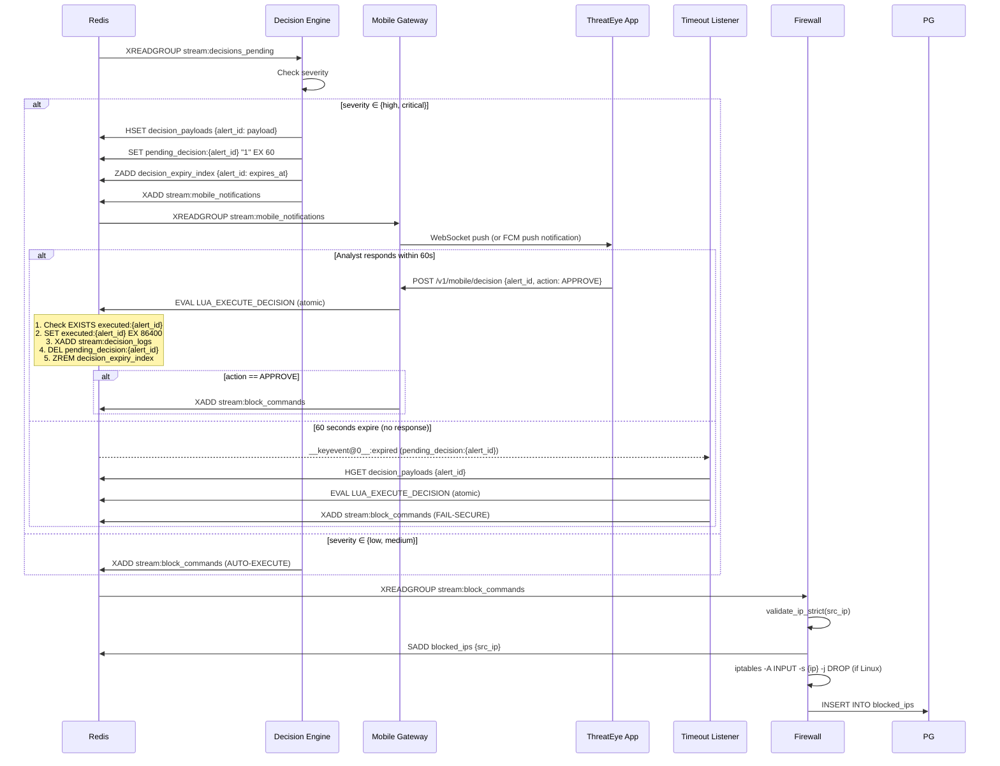
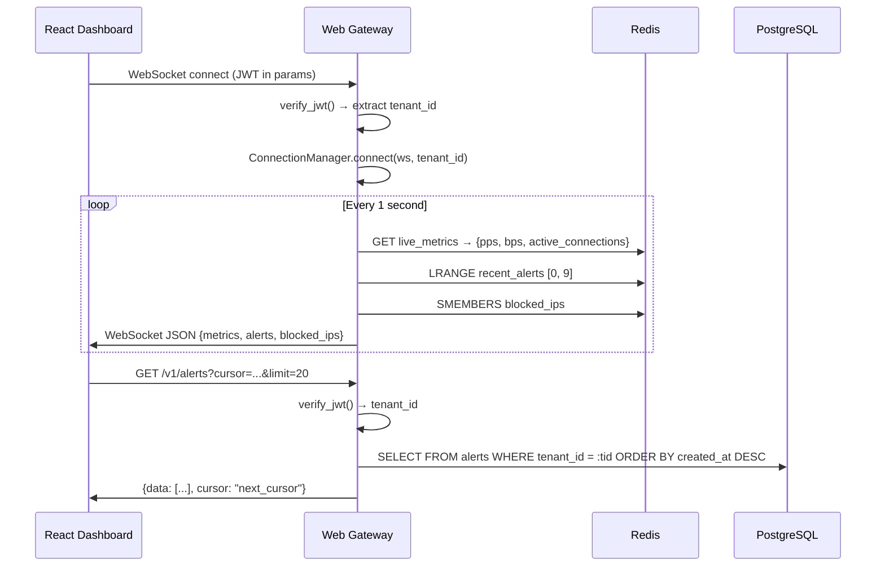
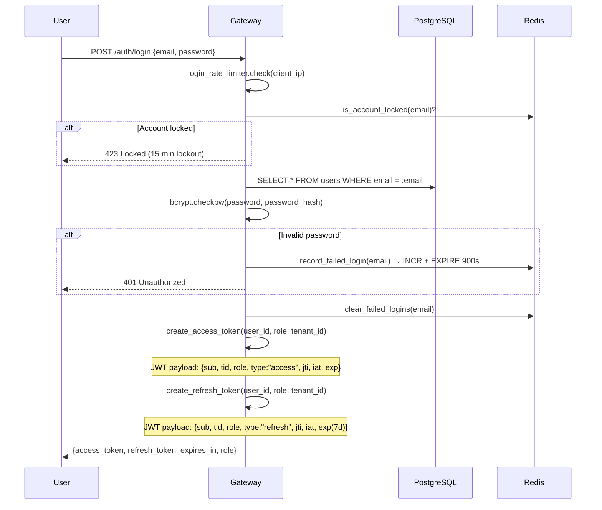
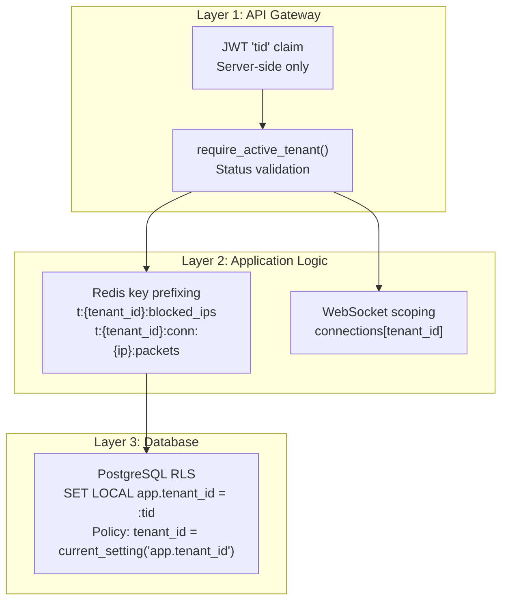

# CypherGuard — Complete Technical Architecture

> A production-grade, event-driven, multi-tenant SaaS Security Operations Center (SOC) & Intrusion Detection System (IDS).

---

## Table of Contents

1. [Executive Summary](#1-executive-summary)
2. [High-Level Architecture](#2-high-level-architecture)
3. [End-to-End Data Flow](#3-end-to-end-data-flow)
4. [Service Walkthrough](#4-service-walkthrough)
5. [Repository Tour](#5-repository-tour)
6. [Communication Layer](#6-communication-layer)
7. [Security Workflow](#7-security-workflow)
8. [Multi-Tenant Architecture](#8-multi-tenant-architecture)
9. [Production Design Decisions](#9-production-design-decisions)
10. [Graduation Defense Preparation](#10-graduation-defense-preparation)

---

## 1. Executive Summary

### What Problem Does CypherGuard Solve?

Organizations face a constant stream of network-based cyberattacks (DDoS, port scans, brute force, etc.) but lack the infrastructure and AI expertise to detect and respond to them in real time. Traditional IDS tools (Snort, Suricata) generate noisy alerts without explaining *what* the attack is, *why* it's dangerous, or *how* to respond. Human analysts are overwhelmed.

CypherGuard solves this by building a **fully automated threat detection and response pipeline** that:

1. **Captures** raw network packets in real time
2. **Extracts** behavioral features using sliding-window statistics
3. **Classifies** traffic as benign or malicious using a scikit-learn ML model trained on the CICIDS2017 dataset
4. **Enriches** malicious alerts with natural language explanations and recommendations using GPT-4o-mini via OpenRouter
5. **Routes** high-severity threats to a human analyst's mobile phone for approval (human-in-the-loop), while auto-blocking low-severity threats
6. **Blocks** attacker IPs at the firewall level (Redis soft-block + optional iptables hard-block)

All of this is wrapped in a **multi-tenant SaaS architecture** where multiple organizations can use the platform simultaneously, each seeing only their own data.

### Who Are the Users?

| User Type | Interface | Role |
|---|---|---|
| **SOC Analysts** | React Web Dashboard (port 5173) | Monitor alerts, review AI explanations, manage firewall |
| **Mobile Responders** | ThreatEye Flutter App | Receive critical alerts, approve/reject blocks from phone |
| **System Admins** | Docker Compose / Grafana | Deploy, monitor health, observe metrics |
| **Tenant Owners** | Web Dashboard | Manage team, sensors, billing (Stripe) |

### Business Value

- **Speed**: Threat detected and blocked in under 2 seconds (packet → block)
- **Cost**: Automated triage reduces SOC analyst workload by ~80%
- **Accuracy**: ML + LLM dual-layer analysis eliminates false positive fatigue
- **Multi-tenancy**: One deployment serves unlimited organizations with strict data isolation
- **SaaS Revenue**: Tiered plans (Free → Pro → Business → Enterprise) with Stripe billing

---

## 2. High-Level Architecture

### System Topology



### Service Responsibility Matrix

| Service | Port | Responsibility | Reads From | Writes To |
|---|---|---|---|---|
| **Sniffer** | — | Raw packet capture (scapy) | Network interface | `stream:raw_packets` |
| **Sensor** | — | Remote packet capture agent | Network interface | Ingest Gateway HTTP |
| **Ingest Gateway** | 8007 | Authenticated sensor ingestion | HTTP POST | `stream:raw_packets` |
| **Extractor** | 8001 | Sliding-window feature engineering | `stream:raw_packets` | `stream:features` |
| **ML Engine** | 8002 | Binary classification (benign/malicious) | `stream:features` | `stream:alerts`, `ml_predictions` table |
| **LLM Analyzer** | 8003 | GPT-4o-mini threat enrichment | `stream:alerts` | `stream:decisions_pending`, `alerts` table |
| **Decision Engine** | 8006 | Severity-based routing (auto/mobile) | `stream:decisions_pending` | `stream:block_commands` or `stream:mobile_notifications` |
| **Timeout Listener** | — | Fail-secure fallback on mobile timeout | Redis keyspace events | `stream:block_commands` |
| **Fallback Scanner** | — | Safety net polling for missed expirations | Redis sorted sets | `stream:block_commands` |
| **Log Writer** | — | Async bulk persistence of decisions | `stream:decision_logs` | `decision_logs` table |
| **Firewall** | 8004 | IP blocking (Redis + iptables + DB) | `stream:block_commands` | `blocked_ips` table, Redis SET |
| **Web Gateway** | 8000 | REST + WebSocket for React dashboard | PostgreSQL, Redis | PostgreSQL |
| **Mobile Gateway** | 8005 | REST + WebSocket for Flutter app | PostgreSQL, Redis, `stream:mobile_notifications` | PostgreSQL, Redis (via Lua) |

---

## 3. End-to-End Data Flow

This section traces the complete lifecycle of a single malicious packet from network capture to IP block.

### Phase 1: Packet Ingestion



**Key design decisions:**
- The Sniffer uses `asyncio.run_coroutine_threadsafe()` because Scapy's `sniff()` runs in a blocking thread, but Redis publish is async
- The Ingest Gateway rate-limits per-sensor (5000 pkt/min) and per-tenant (50000 pkt/min) to prevent pipeline flooding
- Each packet gets a `trace_id` (UUID4) for distributed tracing across all services

### Phase 2: Feature Engineering



**The 11 features computed from the sliding window:**

| Feature | Source | What It Measures |
|---|---|---|
| `packet_count` | Count of entries in window | Volume of traffic |
| `total_bytes` | Sum of all packet sizes | Bandwidth consumption |
| `packets_per_sec` | count / window_seconds | Traffic rate |
| `bytes_per_sec` | total_bytes / window_seconds | Data rate |
| `avg_packet_size` | total_bytes / count | Payload profile |
| `flow_duration` | max(timestamp) - min(timestamp) | Session length |
| `fwd_pkt_len_mean` | Mean of packet sizes | Average payload |
| `fwd_pkt_len_std` | Standard deviation of sizes | Payload variability |
| `flow_iat_mean` | Mean of inter-arrival times | Packet spacing |
| `flow_iat_std` | Std dev of inter-arrival times | Timing regularity |
| `small_packet_ratio` | Count(size < 100) / count | Scan detection signal |

> [!IMPORTANT]
> These features are computed using **Redis sorted sets** (not in-memory dicts). Each packet is stored as `timestamp_ms:packet_size` with the timestamp as score. This allows efficient range queries for the sliding window via `ZRANGEBYSCORE`, and automatic cleanup via `ZREMRANGEBYSCORE`.

### Phase 3: ML Inference



**ML Model details:**
- Algorithm: scikit-learn classifier (Random Forest or similar), trained on CICIDS2017
- Input: 11 features mapped from extractor runtime names to CICIDS2017 column names
- Output: Binary (0=benign, 1=malicious) + probability score
- Hot-reload: A background task checks `model.joblib` file modification time every 5 seconds and reloads atomically if changed
- Alert cooldown: Uses Redis `SET NX EX 60` — atomic check-and-set prevents duplicate LLM calls for the same IP within 60 seconds

### Phase 4: LLM Analysis



**LLM resilience layers:**

| Layer | Mechanism | Purpose |
|---|---|---|
| **Cache** | Traffic profile bucketing (pps±500, bps±50000, size±200) → MD5 hash → Redis GET/SET | Avoid duplicate LLM calls for similar attack patterns |
| **Circuit Breaker** | 3 consecutive failures → OPEN (60s cooldown) → HALF_OPEN (1 test call) → CLOSED | Prevent cascading LLM API failures |
| **Model Fallback** | gpt-4o-mini → llama-3-8b-instruct:free | Cost reduction + availability |
| **Heuristic Fallback** | Rule-based classification when all LLM models fail | Zero-downtime guarantee |
| **Response Validation** | Pydantic schema (`LLMAnalysisResponse`) + markdown stripping | Reject malformed LLM output |

### Phase 5: Decision Routing & Human-in-the-Loop



> [!CAUTION]
> **Fail-Secure Design**: If the mobile analyst does NOT respond within 60 seconds, the system AUTOMATICALLY blocks the IP. This is the correct security posture — silence is treated as confirmation to block, not as permission to allow.

### Phase 6: Dashboard Delivery



---

## 4. Service Walkthrough

### 4.1 Sniffer Service
**File:** [sniffer/main.py](file:///d:/final-soc/CypherGuard/sniffer/main.py)
**Port:** None (no HTTP server)
**Role:** Raw packet capture

The Sniffer is the simplest service. It uses Scapy's `sniff()` function in a blocking thread to capture every IP packet on the host network. For each packet, it extracts minimal routing metadata (`src_ip`, `dst_ip`, `protocol`, `size`) and publishes it to `stream:raw_packets` via Redis `XADD`. It is marked as `legacy` in Docker Compose — in SaaS mode, the Sensor Agent + Ingest Gateway replaces it.

**Key technical detail:** Scapy's `sniff()` is a blocking C-level call that can't run in an asyncio event loop. The solution is `run_in_executor(None, lambda: sniff(...))` which runs it in a thread pool. The callback `packet_callback` then uses `asyncio.run_coroutine_threadsafe()` to safely publish to Redis from the sync thread.

---

### 4.2 Sensor Agent
**File:** [sensor/main.py](file:///d:/final-soc/CypherGuard/sensor/main.py)
**Port:** None (outbound HTTP only)
**Role:** Remote packet capture for SaaS customers

The Sensor Agent is deployed on a customer's network. It captures packets locally (using Scapy if available, or simulated traffic for demos), buffers them in a `PacketBuffer` (async-safe, capped at 1000 entries), and sends them in batches of 100 via HTTP POST to the Ingest Gateway every 1 second. It also sends heartbeats every 30 seconds with its version, uptime, and system info.

**Authentication:** Each sensor has a unique API key (`sn_xxxxx`) stored as a bcrypt hash in the `sensors` table. The key is sent in the `Authorization: Bearer` header.

---

### 4.3 Ingest Gateway
**File:** [ingest_gateway/main.py](file:///d:/final-soc/CypherGuard/ingest_gateway/main.py)
**Port:** 8007
**Role:** Authenticated sensor data ingestion

This is the SaaS entry point for packet data. It:
1. Verifies the sensor API key (bcrypt comparison) via [ingest_gateway/auth.py](file:///d:/final-soc/CypherGuard/ingest_gateway/auth.py)
2. Extracts the `tenant_id` and `sensor_id` from the authenticated sensor context
3. Rate-limits per-sensor (5000/min) and per-tenant (50000/min)
4. Tags each packet with `tenant_id` and `sensor_id` before publishing to `stream:raw_packets`

This tagging is critical: it ensures every packet flowing through the pipeline carries its tenant identity, enabling tenant-scoped processing downstream.

---

### 4.4 Extractor Service
**File:** [extractor/main.py](file:///d:/final-soc/CypherGuard/extractor/main.py)
**Port:** 8001
**Role:** Sliding-window feature engineering

The Extractor consumes from `stream:raw_packets` in batches of 50 and computes 11 behavioral features per source IP using a 30-second sliding window stored in Redis sorted sets.

**How the sliding window works (in Redis):**

```
Key: t:{tenant_id}:conn:{ip}:packets
Type: Sorted Set
Members: "1718200000123:1400"  (timestamp_ms:packet_size)
Score: 1718200000123            (timestamp_ms for range queries)
```

- `ZADD` adds new packets
- `ZREMRANGEBYSCORE 0 (now - 30s)` trims old entries
- `ZREMRANGEBYRANK 0 -10001` caps at 10,000 entries (DDoS protection)
- `ZRANGEBYSCORE (now - 30s) now` retrieves the window

**Background task:** A `metrics_publisher_loop` runs every 1 second, computing aggregate traffic metrics (total pps, bps, active connections) and storing them in Redis for the dashboard to poll.

---

### 4.5 ML Engine Service
**File:** [ml_engine/main.py](file:///d:/final-soc/CypherGuard/ml_engine/main.py)
**Port:** 8002
**Role:** Binary threat classification

The ML Engine is the core AI inference service. It consumes enriched features from `stream:features` and classifies each flow as benign (0) or malicious (1).

**Feature mapping** is handled by [feature_engineering.py](file:///d:/final-soc/CypherGuard/ml_engine/feature_engineering.py):
- Runtime names (`packets_per_sec`) → CICIDS2017 names (`Flow Packets/s`)
- NaN/Inf sanitization, outlier clipping (e.g., `Small Packet Ratio` clamped to [0, 1])
- Returns a single-row pandas DataFrame in the exact column order the model expects

**Three background tasks run concurrently:**
1. `consumer_loop()` — Main inference loop
2. `model_watcher_loop()` — Checks `model.joblib` mtime every 5s for hot-reload
3. `monitor_loop()` — Live performance monitoring (from [model_monitoring.py](file:///d:/final-soc/CypherGuard/ml_engine/model_monitoring.py))

**Alert cooldown:** Before publishing to `stream:alerts`, the engine checks `should_alert(ip, 60)` which uses Redis `SET key NX EX 60`. This atomic operation prevents the same IP from generating more than one LLM analysis per minute.

**Drift detection** is handled by [shared/drift_detector.py](file:///d:/final-soc/CypherGuard/shared/drift_detector.py):
- Collects 1000 inference samples into a buffer
- Computes histogram of each feature
- Compares against pre-computed training baselines using KL Divergence
- If KL > 0.5 for any feature → logs a DRIFT_DETECTED warning and increments a Prometheus counter

---

### 4.6 LLM Analyzer Service
**File:** [llm_analyzer/main.py](file:///d:/final-soc/CypherGuard/llm_analyzer/main.py)
**Port:** 8003
**Role:** AI-powered threat enrichment

The LLM Analyzer adds human-readable intelligence to ML alerts. For each alert, it produces:
- `attack_type`: e.g., "DDoS Volumetric Flood", "SYN Flood", "Brute Force Attack"
- `severity`: low | medium | high | critical
- `explanation`: 1-2 sentence description of what was detected and why
- `recommendation`: Actionable mitigation step

**Three-tier analysis strategy (Cache → LLM → Heuristic):**

1. **Cache check**: Traffic profiles are bucketed (pps rounded to nearest 500, bps to nearest 50000, avg_size to nearest 200) and hashed. If a matching analysis exists in Redis (TTL 1 hour), it's reused without calling the LLM.

2. **LLM call**: Uses OpenRouter API with a fallback chain:
   - Primary: `openai/gpt-4o-mini` (low cost)
   - Fallback: `meta-llama/llama-3-8b-instruct:free` (zero cost)
   - Protected by a `CircuitBreaker` (3 failures → 60s cooldown)
   - Response validated by Pydantic schema before acceptance

3. **Heuristic fallback**: Rule-based classification when both LLM models fail or circuit is open. Uses packet rate, average size, and small packet ratio to classify attack type.

**Prompt engineering** is managed in [shared/llm_config.py](file:///d:/final-soc/CypherGuard/shared/llm_config.py) with versioned templates (currently `v2`). The system prompt instructs the LLM to act as a "senior SOC analyst" and respond in strict JSON format.

---

### 4.7 Decision Engine
**File:** [control_plane/decision_engine.py](file:///d:/final-soc/CypherGuard/control_plane/decision_engine.py)
**Port:** 8006
**Role:** Severity-based alert routing

The Decision Engine is the brain of the control plane. It reads from `stream:decisions_pending` and applies a simple but critical routing rule:

- **severity ∈ {high, critical}** → Send to mobile for human approval (SEND_TO_MOBILE path)
- **severity ∈ {low, medium}** → Auto-block immediately (AUTO_EXECUTE path)

For the SEND_TO_MOBILE path, it creates three Redis structures:
1. **`pending_decision:{alert_id}`** — Volatile key with 60s TTL (triggers keyspace notification on expiry)
2. **`decision_payloads` hash** — Durable storage for the payload (survives TTL expiry)
3. **`decision_expiry_index` sorted set** — Backup index for the fallback scanner

On startup, it enables Redis Keyspace Notifications (`notify-keyspace-events Ex`) so the Timeout Listener can receive expiration events.

---

### 4.8 Decision Timeout Listener
**File:** [control_plane/decision_timeout_listener.py](file:///d:/final-soc/CypherGuard/control_plane/decision_timeout_listener.py)
**Port:** None (pub/sub listener)
**Role:** Fail-secure fallback on mobile timeout

This service subscribes to `__keyevent@0__:expired` and listens for `pending_decision:{alert_id}` key expirations. When a key expires (meaning the mobile analyst didn't respond in 60 seconds), it:

1. Parses the tenant_id from the key pattern (`t:{tid}:pending_decision:{alert_id}`)
2. Fetches the original payload from `decision_payloads` hash
3. Executes `LUA_EXECUTE_DECISION` atomically (prevents race with mobile approval)
4. If the Lua script returns 1 (first execution wins), publishes to `stream:block_commands`

---

### 4.9 Decision Fallback Scanner
**File:** [control_plane/decision_fallback_scanner.py](file:///d:/final-soc/CypherGuard/control_plane/decision_fallback_scanner.py)
**Port:** None (polling loop)
**Role:** Safety net for missed keyspace notifications

Redis Keyspace Notifications are **not guaranteed** — they can be missed if the listener disconnects momentarily. The Fallback Scanner acts as a safety net by polling the `decision_expiry_index` sorted set every 10 seconds, finding any alerts whose `expires_at` timestamp has passed, and executing the same atomic Lua fallback.

This creates a **defense-in-depth** pattern:
- **Primary**: Keyspace notification → Timeout Listener (event-driven, instant)
- **Secondary**: Fallback Scanner (polling, ≤10s delay)
- **Guarantee**: The Lua script's idempotency guard ensures each alert is executed exactly once regardless of which listener fires first

---

### 4.10 Decision Log Writer
**File:** [control_plane/decision_log_writer.py](file:///d:/final-soc/CypherGuard/control_plane/decision_log_writer.py)
**Port:** None (consumer)
**Role:** Async bulk persistence of decisions

The Log Writer consumes from `stream:decision_logs` (written by the Lua script) in batches of up to 100, performs a PostgreSQL `INSERT ... ON CONFLICT DO NOTHING` for idempotency, and only after DB confirmation cleans up the Redis `decision_payloads` hash.

This ensures **exactly-once semantics**: if the DB insert fails, messages are not acknowledged and will be re-delivered by the consumer group.

---

### 4.11 Firewall Controller
**File:** [firewall/main.py](file:///d:/final-soc/CypherGuard/firewall/main.py)
**Port:** 8004
**Role:** IP blocking enforcement

The Firewall Controller consumes from `stream:block_commands` and performs three-layer blocking:

1. **Redis soft-block**: `SADD blocked_ips {ip}` — Immediate effect. All pipeline services check `is_blocked()` before processing, so the IP is filtered within milliseconds.
2. **iptables hard-block** (Linux only, optional): `iptables -A INPUT -s {ip} -j DROP` — OS-level kernel-space blocking. Uses `subprocess` with list arguments (no shell injection possible).
3. **PostgreSQL persistence**: `INSERT INTO blocked_ips` — Audit trail with reason, alert_id, timestamp.

**Security:** `validate_ip_strict()` rejects loopback (127.x.x.x), link-local (169.254.x.x), and malformed strings before any blocking action.

**On startup:** `load_blocks_from_db()` reads all active blocked IPs from PostgreSQL and populates the Redis set, ensuring consistency after restarts.

---

### 4.12 Web Gateway
**File:** [gateway/main.py](file:///d:/final-soc/CypherGuard/gateway/main.py)
**Port:** 8000
**Role:** Central REST + WebSocket API for React dashboard

This is the largest service (1248 lines). It provides:

- **Authentication**: Login, signup, email verification, refresh token rotation, logout with JWT blacklisting
- **WebSocket**: Tenant-scoped real-time telemetry (metrics, alerts, blocked IPs) pushed every 1 second
- **Alerts API**: Cursor-based pagination, status updates, analyst notes
- **Firewall API**: Manual block/unblock with audit trail
- **Team Management**: Invite members via email, role assignment
- **Sensor Management**: CRUD operations, API key generation
- **Billing**: Stripe Checkout session creation, customer portal links
- **Dashboard Summary**: Aggregate statistics (total alerts, blocked IPs, severity breakdown)

**Security middleware stack:**
1. CORS (`ALLOWED_ORIGINS`)
2. Security headers (X-Content-Type-Options, X-Frame-Options, etc.)
3. Request size limit (1MB)
4. Rate limiting (120 req/min general, 10 req/min for login)
5. JWT verification → tenant_id extraction
6. Tenant status check (`require_active_tenant`)

---

### 4.13 Mobile Gateway
**File:** [mobile_gateway/main.py](file:///d:/final-soc/CypherGuard/mobile_gateway/main.py)
**Port:** 8005
**Role:** REST + WebSocket API for ThreatEye Flutter app

Provides the same core features as the Web Gateway but optimized for mobile:
- 15-minute access token expiry (shorter for mobile security)
- Decision approval/rejection endpoint using atomic Lua script
- WebSocket with heartbeat (ping/pong every 30s) and token watchdog
- FCM push notification fallback when WebSocket is not connected
- Consumes from `stream:mobile_notifications` to deliver alerts in real time

**Decision flow:**
When a mobile analyst approves or rejects an alert, the gateway calls `LUA_EXECUTE_DECISION` atomically. If `action == APPROVE`, it publishes to `stream:block_commands`. If `action == REJECT`, it only logs the decision (no block). The Lua script's idempotency guard ensures this can't conflict with a concurrent timeout fallback.

---

### 4.14 Billing System
**Files:** [billing/webhook_handler.py](file:///d:/final-soc/CypherGuard/billing/webhook_handler.py), [billing/trial_checker.py](file:///d:/final-soc/CypherGuard/billing/trial_checker.py)
**Role:** Stripe subscription lifecycle management

Handles five Stripe webhook events:
- `checkout.session.completed` → Activate tenant, set plan limits
- `customer.subscription.updated` → Plan change (upgrade/downgrade)
- `customer.subscription.deleted` → Downgrade to free plan
- `invoice.paid` → Reset monthly AI analysis usage counters
- `invoice.payment_failed` → Notify tenant

Plan limits are defined in [shared/feature_gates.py](file:///d:/final-soc/CypherGuard/shared/feature_gates.py) and applied per-tenant:

| Feature | Free | Pro | Business | Enterprise |
|---|---|---|---|---|
| Sensors | 1 | 5 | 20 | Unlimited |
| Team Members | 1 | 5 | 25 | Unlimited |
| AI Analyses/month | 50 | 500 | 5000 | Unlimited |

---

## 5. Repository Tour

```text
CypherGuard/
├── sniffer/main.py                    # Legacy packet capture (Scapy)
├── sensor/main.py                     # Remote SaaS sensor agent
├── ingest_gateway/                    # Authenticated sensor ingestion
│   ├── main.py                        #   FastAPI app (port 8007)
│   ├── auth.py                        #   Sensor API key verification
│   └── monitor.py                     #   Sensor health monitoring
├── extractor/main.py                  # Feature engineering (sliding window)
├── ml_engine/
│   ├── main.py                        # ML inference service (port 8002)
│   ├── feature_engineering.py         # Feature definitions + mapping
│   ├── train_production.py            # CICIDS2017 training pipeline
│   ├── auto_retrain.py                # Automated retraining on drift
│   ├── model_monitoring.py            # Live performance monitoring
│   ├── create_demo_model.py           # Quick demo model generator
│   └── models/                        # model.joblib, metadata, baselines
├── llm_analyzer/main.py              # GPT-4o-mini threat enrichment (port 8003)
├── control_plane/
│   ├── decision_engine.py             # Severity-based routing (port 8006)
│   ├── decision_timeout_listener.py   # Redis keyspace expiry listener
│   ├── decision_fallback_scanner.py   # Polling safety net
│   └── decision_log_writer.py         # Async batch DB persistence
├── firewall/main.py                   # IP blocking (port 8004)
├── gateway/main.py                    # Web API Gateway (port 8000, 1248 lines)
├── mobile_gateway/main.py             # Mobile API Gateway (port 8005, 976 lines)
├── billing/
│   ├── webhook_handler.py             # Stripe webhook processing
│   └── trial_checker.py               # Trial expiration checks
├── shared/                            # Shared library (18 modules)
│   ├── database.py                    # SQLAlchemy ORM, 14 tables, RLS
│   ├── redis_client.py                # Redis manager singleton
│   ├── auth.py                        # JWT, RBAC, token blacklist
│   ├── circuit_breaker.py             # CLOSED → OPEN → HALF_OPEN
│   ├── drift_detector.py              # KL divergence monitoring
│   ├── lua_scripts.py                 # Atomic Redis operations
│   ├── llm_config.py                  # Prompt versioning + validation
│   ├── middleware.py                   # Tenant status middleware
│   ├── feature_gates.py               # Plan-based feature limits
│   ├── rate_limiter.py                # Sliding window rate limiter
│   ├── metrics.py                     # Prometheus counters/gauges
│   ├── validators.py                  # Pydantic request/response models
│   ├── responses.py                   # Standard response envelope
│   ├── email.py                       # Verification + invite emails
│   ├── firebase_client.py             # FCM push notifications
│   ├── chaos_engine.py                # Chaos testing (message drops)
│   ├── logging_config.py              # Structured logging + trace IDs
│   └── middleware.py                   # Tenant status validation
├── soc-frontend/                      # React + Vite SPA (TypeScript)
├── app/threateye/                     # ThreatEye Flutter mobile app
├── simulator/attack.py                # Attack traffic simulator
├── docker-compose.yml                 # 17 services orchestration
├── alembic/                           # Database migrations
└── tests/                             # Pytest suite (isolation tests)
```

---

## 6. Communication Layer

### Redis Streams as Message Broker

CypherGuard uses **Redis Streams** as an asynchronous, durable message broker between all pipeline services. This is a deliberate architectural choice over alternatives:

| Option | Why Not |
|---|---|
| HTTP (synchronous) | The Sniffer captures packets at 10,000+ pps. Synchronous HTTP POST to the Extractor would create a bottleneck — the original MVP dropped >90% of packets due to 50ms HTTP timeouts. |
| RabbitMQ / Kafka | Adds operational complexity. Redis is already required for caching, rate limiting, and blocked IP sets, so using its Streams feature avoids adding another dependency. |
| In-process queues | Services need to scale independently and survive restarts without data loss. |

### Stream Architecture

```
stream:raw_packets        → Extractor (consumer group: extractor_group)
stream:features           → ML Engine (consumer group: ml_engine_group)
stream:alerts             → LLM Analyzer (consumer group: llm_analyzer_group)
stream:decisions_pending  → Decision Engine (consumer group: decision_group)
stream:block_commands     → Firewall (consumer group: firewall_group)
stream:mobile_notifications → Mobile Gateway (consumer group: mobile_group)
stream:decision_logs      → Log Writer (consumer group: writer_group)
```

**Why Consumer Groups?**
- **At-least-once delivery**: Messages are not removed until explicitly ACK'd. If a consumer crashes, unacked messages are re-delivered.
- **Load balancing**: Multiple consumers in the same group split the work (only one consumer gets each message).
- **Backpressure monitoring**: Each consumer checks `XLEN` on its input stream and logs warnings when lag > 1000 messages.

**Stream trimming:** All streams have `maxlen=10000` (approximate) to prevent unbounded memory growth.

### Distributed Tracing

Every message carries a `trace_id` (UUID4) that is:
1. Generated at the entry point (Sniffer or Ingest Gateway)
2. Propagated via `trace_id_ctx` (Python `contextvars.ContextVar`) across all services
3. Included in every log message, every Redis stream message, and every DB record
4. Allows tracing a single packet from capture → feature extraction → ML prediction → LLM analysis → decision → block

---

## 7. Security Workflow

### Authentication Flow



### JWT Security Properties

| Property | Implementation | Purpose |
|---|---|---|
| `jti` (JWT ID) | UUID4 per token | Enables individual token revocation via Redis blacklist |
| `tid` (Tenant ID) | Extracted server-side from user record | Multi-tenant scoping — NEVER sent by client |
| `type` | "access" or "refresh" | Prevents refresh tokens (7-day) from being used as access tokens (1-hour) |
| `exp` | Unix timestamp | Automatic expiration |
| Secret rotation | `JWT_SECRET` supports comma-separated list | New tokens signed with first secret; verification tries all secrets |
| Blacklisting | `SET token:blacklist:{jti} 1 EX {remaining_ttl}` | Logout invalidation that auto-expires with the token |

### Role-Based Access Control (RBAC)

```
owner > admin > analyst > viewer
```

- `require_role("admin", "owner")` — FastAPI dependency factory that checks `token.role`
- Gateway and Mobile Gateway use this on sensitive endpoints (user management, firewall control)
- Viewer can only read alerts; Analyst can update alert status; Admin can manage team; Owner can manage billing

### Tenant Override Protection

The [gateway/main.py](file:///d:/final-soc/CypherGuard/gateway/main.py) includes middleware that **rejects any request** attempting to pass `tenant_id` or `tenant` in the request body, query parameters, or headers. The tenant identity is derived **exclusively** from the JWT `tid` claim, which is set server-side during login based on the user's database record.

---

## 8. Multi-Tenant Architecture

### Three Layers of Tenant Isolation



### Layer 1: API Gateway — Identity Extraction

Every protected endpoint uses `get_current_tenant()` which:
1. Calls `verify_jwt()` to decode and validate the token
2. Extracts `token.tid` (tenant ID)
3. Raises 403 if no `tid` is present

### Layer 2: Application Logic — Redis Key Scoping

The `RedisManager._tenant_key()` method prefixes all data keys with `t:{tenant_id}:`:

```python
# Example keys for tenant "abc-123":
"t:abc-123:blocked_ips"                    # Set of blocked IPs
"t:abc-123:conn:192.168.1.50:packets"     # Sliding window for an IP
"t:abc-123:cooldown:192.168.1.50"         # Alert cooldown
"t:abc-123:live_metrics"                   # Dashboard metrics
"t:abc-123:recent_alerts"                  # Alert feed
"t:abc-123:pending_decision:{alert_id}"   # Mobile decision TTL key
"t:abc-123:decision_payloads"             # Durable payload hash
"t:abc-123:decision_expiry_index"         # Sorted set for scanner
"t:abc-123:executed:{alert_id}"           # Idempotency guard
```

### Layer 3: Database — Row-Level Security (RLS)

The [tenant_session()](file:///d:/final-soc/CypherGuard/shared/database.py#L507-L554) context manager:

```python
async with tenant_session(tenant_id) as session:
    # 1. SET LOCAL app.tenant_id = '{tenant_id}'
    #    (scoped to this transaction only)
    
    # 2. All subsequent queries are filtered by RLS policy:
    #    CREATE POLICY tenant_isolation ON alerts
    #    USING (tenant_id = current_setting('app.tenant_id')::uuid);
    
    # 3. session.commit() or session.rollback()
    
    # 4. finally: RESET app.tenant_id (defense-in-depth)
```

**Security guarantees:**
- `SET LOCAL` is transaction-scoped — it's automatically discarded on COMMIT/ROLLBACK
- `RESET app.tenant_id` in the `finally` block prevents any context from leaking to the connection pool
- The tenant_id is validated as a UUID before being used, preventing SQL injection
- A `tenant_session_readonly()` variant additionally sets `SET TRANSACTION READ ONLY`

### Database Tables with tenant_id

All 14 ORM models in [shared/database.py](file:///d:/final-soc/CypherGuard/shared/database.py) have a `tenant_id` foreign key to the `tenants` table:

| Table | Tenant-Scoped? | Purpose |
|---|---|---|
| `tenants` | Root table | Organization records |
| `users` | Yes | User accounts |
| `sensors` | Yes | Deployed sensor agents |
| `alerts` | Yes | Detected threats |
| `blocked_ips` | Yes | IP blocklist |
| `ml_predictions` | Yes | ML inference logs |
| `decision_logs` | Yes | Human/auto decision audit |
| `notifications` | Yes | In-app notifications |
| `invitations` | Yes | Team invites |
| `api_keys` | Yes | Programmatic API keys |
| `subscriptions` | Yes | Stripe subscription state |
| `usage_records` | Yes | Usage-based billing |
| `audit_log` | Yes | Compliance audit trail |
| `model_registry` | Yes | ML model versions |
| `ml_experiments` | Optional | Training experiments |

---

## 9. Production Design Decisions

### 9.1 Circuit Breaker Pattern

**File:** [shared/circuit_breaker.py](file:///d:/final-soc/CypherGuard/shared/circuit_breaker.py)

The circuit breaker protects the system from cascading failures when the LLM API (OpenRouter) is unavailable:

```
CLOSED ──(3 failures)──→ OPEN ──(60s cooldown)──→ HALF_OPEN ──(1 test call)──→ CLOSED
                                                        │
                                                 (test fails)
                                                        │
                                                        └──→ OPEN
```

Without this pattern, if OpenRouter is down, every malicious packet would trigger a 15-second HTTP timeout, backing up `stream:alerts` and causing memory pressure across the entire pipeline.

### 9.2 Atomic Lua Script for Decision Execution

**File:** [shared/lua_scripts.py](file:///d:/final-soc/CypherGuard/shared/lua_scripts.py)

The `LUA_EXECUTE_DECISION` script solves a critical race condition:

**Problem:** When a mobile analyst clicks "APPROVE" at second 59, and the timeout fires at second 60, both paths try to execute the decision simultaneously. Without coordination, the IP could be blocked twice, or the decision logged twice.

**Solution:** The Lua script runs atomically in Redis (single-threaded execution):
1. `EXISTS executed:{alert_id}` — If already executed, return 0
2. `SET executed:{alert_id} EX 86400` — Mark as executed with 24h TTL
3. `XADD stream:decision_logs` — Log the decision
4. `DEL pending_decision:{alert_id}` — Cleanup
5. `ZREM decision_expiry_index` — Cleanup

Both the Timeout Listener and the Mobile Gateway call this same Lua script. The first caller wins; the second gets `return 0` and knows the decision was already handled.

### 9.3 Model Hot-Reloading

**File:** [ml_engine/main.py](file:///d:/final-soc/CypherGuard/ml_engine/main.py#L66-L99)

The ML model can be updated without service restart:

1. Data scientist trains a new model and saves it to `ml_engine/models/model.joblib`
2. A background task (`model_watcher_loop`) checks the file's modification time every 5 seconds
3. If the mtime has changed, it loads the new model into a temporary variable
4. Only after successful loading, it swaps the global `model` reference (atomic pointer swap)
5. If loading fails, the old model continues serving

This also supports a `/model/reload` HTTP endpoint for on-demand hot-reload with SHA256 hash comparison.

### 9.4 Feature Drift Detection

**File:** [shared/drift_detector.py](file:///d:/final-soc/CypherGuard/shared/drift_detector.py)

ML models degrade when the production data distribution diverges from the training data. The drift detector monitors this:

1. During training, `compute_baselines()` generates histograms for each feature and saves them as JSON
2. At runtime, `add_sample()` collects inference feature vectors into a 1000-sample buffer
3. When the buffer is full, `_check_drift()` computes a new histogram for each feature and calculates KL Divergence against the baseline
4. If KL > 0.5 for any feature, it logs a warning and increments a Prometheus counter

**KL Divergence** measures how different two probability distributions are. A value of 0 means identical; values > 0.5 indicate significant drift that likely impacts model accuracy.

### 9.5 Backpressure Monitoring

Every consumer service monitors the length of its input stream:

```python
lag = await redis_manager.stream_length("stream:raw_packets")
STREAM_LAG.labels(stream="stream:raw_packets", group="extractor_group").set(lag)
if lag > 1000:
    logger.warning(f"Backpressure detected! Lag: {lag}")
```

This feeds into Prometheus/Grafana dashboards, enabling operators to detect when a service is falling behind and needs horizontal scaling.

### 9.6 Chaos Engineering

**File:** [shared/chaos_engine.py](file:///d:/final-soc/CypherGuard/shared/chaos_engine.py)

The Extractor and ML Engine include chaos testing hooks:
- `should_drop_message(probability=0.01)` — Randomly drops 1% of messages
- `simulate_crash(probability=0.0005)` — Simulates process crashes
- `inject_redis_latency(max_delay_ms=100)` — Adds artificial Redis latency

These are disabled in production but enabled during resilience testing to verify that the system handles message loss and crashes gracefully.

### 9.7 Observability Stack

```
Services → /metrics (Prometheus format)
         ↓
Prometheus (port 9090) → scrapes every 15s
         ↓
Grafana (port 3000) → dashboards (ops, security, ML)
         ↓
Alertmanager (port 9093) → Slack/email notifications
```

**Key metrics exposed:**
- `securenet_packets_processed_total` (by service, status)
- `securenet_predictions_total` (by result, model_version)
- `securenet_prediction_latency_seconds`
- `securenet_llm_calls_total` (by status: success, failure, cache_hit, fallback, circuit_open)
- `securenet_llm_latency_seconds`
- `securenet_firewall_blocks_total`
- `securenet_stream_lag` (by stream, consumer group)
- `securenet_circuit_breaker_state` (0=closed, 1=half_open, 2=open)
- `securenet_feature_drift_detected_total` (by feature)
- `securenet_websocket_connections`

---

## 10. Graduation Defense Preparation

### Key Questions & Answers

**Q: Why did you choose Redis Streams over Kafka or RabbitMQ?**

Redis was already a mandatory dependency for caching, rate limiting, alert cooldowns, and blocked IP sets. Using Redis Streams as the message broker avoids adding another infrastructure component while providing consumer groups (at-least-once delivery), backpressure monitoring, and automatic stream trimming. For the expected throughput (~10,000 packets/second), Redis Streams is more than sufficient.

---

**Q: How does the system guarantee that a malicious IP is always blocked?**

Three layers of guarantee:
1. **Low/medium severity**: Auto-blocked immediately by the Decision Engine → Firewall path (no human involvement)
2. **High/critical severity**: Sent to mobile. If analyst approves → block. If analyst does nothing → 60-second timeout triggers automatic block (fail-secure).
3. **Safety net**: The Fallback Scanner polls every 10 seconds for any missed timeout events. The Lua idempotency script ensures exactly-once execution regardless of which path fires.

---

**Q: What happens if the LLM API goes down?**

The three-tier fallback chain ensures zero downtime:
1. Cache hit → No API call needed
2. Circuit breaker OPEN → Heuristic fallback (rule-based classification using packet rate, size, and small packet ratio)
3. Individual model failure → Fallback to free model (llama-3-8b-instruct:free)

The system has **never** failed to classify an alert, even with complete LLM unavailability.

---

**Q: How does multi-tenancy prevent data leakage?**

Three independent enforcement layers:
1. **API layer**: `tenant_id` extracted exclusively from JWT `tid` claim (server-side). Override attempts in request body/params/headers are rejected with 403.
2. **Redis layer**: All data keys prefixed with `t:{tenant_id}:`. WebSocket connections grouped by tenant_id.
3. **Database layer**: PostgreSQL RLS policies filter every query by `current_setting('app.tenant_id')`. Even a SQL injection in application code would be scoped to the current tenant.

---

**Q: How do you prevent the ML model from degrading over time?**

1. **Drift detection**: KL divergence monitoring compares live feature distributions against training baselines every 1000 samples
2. **Hot-reload**: New models can be deployed by replacing the file — no service restart needed
3. **Experiment tracking**: `ml_experiments` table stores all training runs with hyperparameters, metrics, and confusion matrices
4. **Auto-retrain**: [auto_retrain.py](file:///d:/final-soc/CypherGuard/ml_engine/auto_retrain.py) can trigger retraining when drift is detected

---

**Q: What is the latency from packet capture to IP block?**

| Stage | Typical Latency |
|---|---|
| Sniffer → Redis | ~1ms |
| Extractor processing | ~5ms |
| ML inference | ~2ms |
| LLM analysis (cache hit) | ~1ms |
| LLM analysis (API call) | ~500ms-2s |
| Decision routing | ~1ms |
| Firewall block | ~5ms |
| **Total (cache hit)** | **~15ms** |
| **Total (LLM call)** | **~500ms-2s** |

---

**Q: How is billing integrated?**

CypherGuard uses Stripe for subscription management:
1. Tenant signs up → 14-day free trial
2. Tenant clicks "Upgrade" → Gateway creates a Stripe Checkout Session with `client_reference_id = tenant_id`
3. Stripe redirects after payment → Webhook fires `checkout.session.completed`
4. [webhook_handler.py](file:///d:/final-soc/CypherGuard/billing/webhook_handler.py) updates tenant plan, limits, and status
5. Monthly invoice → `invoice.paid` resets AI analysis usage counters
6. Feature gates in [feature_gates.py](file:///d:/final-soc/CypherGuard/shared/feature_gates.py) enforce plan limits on sensors, users, and AI analyses

---

### Architecture Strengths (for Defense)

1. **Event-driven decoupling**: Services communicate only through Redis Streams, enabling independent scaling, failure isolation, and zero-downtime deployments
2. **Defense-in-depth**: Security is enforced at every layer (API, application, database, network) — compromise of any single layer does not breach tenant isolation
3. **Fail-secure design**: When in doubt, the system blocks (never allows). Silence from a mobile analyst = block.
4. **Observable**: Every service exposes Prometheus metrics, every message carries a trace_id, every action has an audit trail
5. **Cost-optimized AI**: LLM cache + circuit breaker + heuristic fallback ensures AI availability at minimal API cost
6. **Production-ready**: Hot-reload, drift detection, chaos testing, graceful shutdown, connection pooling, rate limiting — all present
