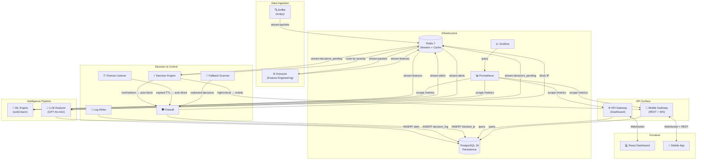

# SecureNet SOC — Architecture Overview

## System Architecture



## Data Flow

### 1. Packet Ingestion
Raw network packets → scapy capture → Redis Stream `stream:packets`

### 2. Feature Engineering
Packets → rolling window statistics (30s) → 11 features → Redis Stream `stream:features`

### 3. ML Inference
Features → scikit-learn Random Forest → benign/malicious classification
- Predictions logged to PostgreSQL `ml_predictions` table
- Feature drift detection via KL divergence
- Alert cooldown prevents duplicate LLM calls

### 4. LLM Classification
Malicious alerts → GPT-4o-mini (or heuristic fallback) → attack type + severity
- Cache → LLM → Heuristic Fallback chain
- Response validated with Pydantic schema
- Results persisted to PostgreSQL `alerts` table

### 5. Decision Routing
```
Critical/High → Mobile dispatch → SOC analyst decision → APPROVE/REJECT/ESCALATE
Medium/Low → Auto-block → Firewall → iptables + PostgreSQL
Timeout (60s) → Auto-block fallback
```

### 6. Observability
All services expose `/metrics` (Prometheus) → 3 Grafana dashboards → 21 alert rules → Alertmanager

## Communication Patterns

| Pattern | Technology | Use Case |
|---|---|---|
| **Event streaming** | Redis Streams | Inter-service pipeline (packets → features → alerts) |
| **Consumer groups** | Redis XREADGROUP | Exactly-once processing with ACK |
| **Pub/Sub** | Redis XADD | Dashboard WebSocket broadcast |
| **Request/Response** | HTTP REST | API Gateway ↔ clients |
| **Bidirectional** | WebSocket | Real-time dashboard + mobile |
| **Atomic operations** | Redis Lua scripts | Decision execution (idempotent) |

## Security Architecture

```
┌─────────────────────────────────────────────┐
│                  Traefik                     │
│        TLS Termination + HSTS               │
│       Let's Encrypt auto-renewal            │
├─────────────────────────────────────────────┤
│              Security Headers               │
│  X-Frame-Options │ X-Content-Type │ CSP     │
├─────────────────────────────────────────────┤
│             Rate Limiting                   │
│   Gateway: 120/60s │ Mobile Auth: 5/60s     │
├─────────────────────────────────────────────┤
│       JWT Authentication (jti claims)       │
│  Access Token (1h) + Refresh Token (7d)     │
│  Token Blacklisting (Redis) on logout       │
│  Refresh Token Rotation (one-time use)      │
├─────────────────────────────────────────────┤
│          Account Lockout                    │
│  5 failed attempts → 15 min lockout         │
│  Constant-time comparison (timing attack)   │
├─────────────────────────────────────────────┤
│         Input Validation (Pydantic)         │
│  IP validation │ Size limits │ SQL defense   │
├─────────────────────────────────────────────┤
│            Audit Trail                      │
│  PostgreSQL audit_log table                 │
│  Login/logout/block/decision events         │
└─────────────────────────────────────────────┘
```
