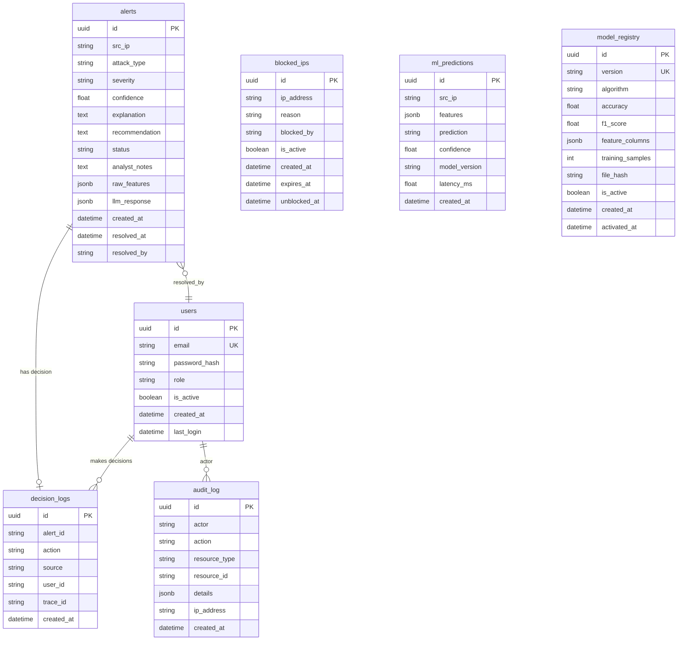

# SecureNet SOC — Database Schema

## Entity Relationship Diagram



## Table Details

### `users`
Stores SOC analyst accounts. Passwords are bcrypt-hashed. Roles: `admin`, `analyst`, `viewer`.

| Column | Type | Notes |
|---|---|---|
| `id` | UUID | Generated server-side |
| `email` | VARCHAR(255) | Unique, used for login |
| `password_hash` | TEXT | bcrypt hash |
| `role` | VARCHAR(20) | `admin` / `analyst` / `viewer` |
| `is_active` | BOOLEAN | Soft delete support |
| `last_login` | TIMESTAMP | Updated on each login |

### `alerts`
Permanent threat log. Every ML-flagged + LLM-classified alert is persisted here.

| Column | Type | Notes |
|---|---|---|
| `status` | VARCHAR(20) | `new` → `acknowledged` → `resolved` → `false_positive` |
| `raw_features` | JSONB | Original extractor features for reproducibility |
| `llm_response` | JSONB | Complete LLM output (attack_type, severity, etc.) |
| `analyst_notes` | TEXT | Free-form notes from SOC analyst |

**Indexes:** `(created_at DESC, id DESC)` for cursor pagination, `severity` for filtered queries.

### `ml_predictions`
Every ML inference is logged for model performance tracking and drift analysis.

| Column | Type | Notes |
|---|---|---|
| `features` | JSONB | Input features at inference time |
| `latency_ms` | FLOAT | Inference wall-clock time |
| `model_version` | VARCHAR | Maps to `model_registry.version` |

### `audit_log`
Compliance-grade event log for forensic investigation.

| Action | Actor | Resource |
|---|---|---|
| `auth.login` | user email | session ID |
| `auth.mobile_login` | user email | session ID |
| `auth.logout` | user email | token JTI |
| `firewall.block` | user email or `system` | IP address |
| `firewall.unblock` | user email | IP address |
| `alert.update` | user email | alert ID |

### `model_registry`
Tracks deployed ML models for versioning and hot-reload verification.

| Column | Type | Notes |
|---|---|---|
| `file_hash` | VARCHAR(64) | SHA256 of model file |
| `is_active` | BOOLEAN | Only one model active at a time |
| `feature_columns` | JSONB | Feature list for schema validation |

## Migrations

Managed by Alembic with async PostgreSQL support:

```bash
# Generate new migration
alembic revision --autogenerate -m "description"

# Apply migrations
alembic upgrade head

# Rollback one step
alembic downgrade -1
```

### Migration History

| Revision | Description |
|---|---|
| `2e7b90c40679` | Initial schema (users, alerts, blocked_ips, decision_logs, ml_predictions, audit_log) |
| `a1b2c3d4e5f6` | Phase 3: Composite indexes, model_registry table, decision_logs.user_id |
