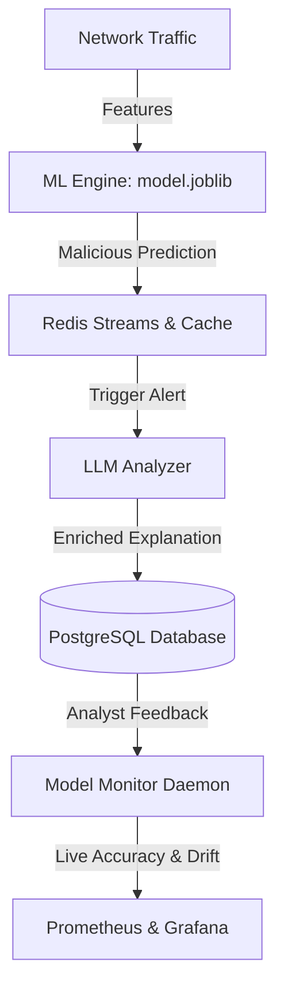

# SecureNet SOC — AI & Machine Learning Subsystem

This document provides a simple, high-level explanation of the AI/ML components in the SecureNet-SOC project. It details **what** has been built, **why** it was designed that way, and **hosw** it operates.

---

## Architecture Overview

The AI part of this project consists of two core systems working hand-in-hand:
1. **The ML Detection Engine (`ml_engine`)**: A fast, local classification system that processes network flows to instantly detect attacks.
2. **The LLM Analysis Engine (`llm_analyzer`)**: A deep analysis system that uses Large Language Models to write natural language explanations, assess threat severity, and suggest mitigations for detected attacks.

---

## 1. ML Detection Engine (`ml_engine`)

### What It Does
* Groups raw packets into network flows and extracts 11 aligned traffic features (e.g., flow rate, average packet size, small packet ratio).
* Sanitizes features (clips extreme outliers and replaces invalid data) to prevent classification errors.
* Classifies flows into `benign` or `malicious` using the current production model.
* Automatically compares five major algorithms (**RandomForest**, **XGBoost**, **GradientBoosting**, **LightGBM**, and **CatBoost**) to select and deploy the best performer.

### Why It's Built This Way
* **Speed**: Classic machine learning models run in less than a millisecond, making them fast enough to process high-throughput network streams.
* **Accuracy**: Comparing multiple algorithms ensures the system always runs on the most accurate model for the current threat landscape.

---

## 2. LLM Analysis Engine (`llm_analyzer`)

### What It Does
* Takes the raw packet metrics from malicious alerts and translates them into plain English summaries.
* Infers severity levels (Low, Medium, High, Critical) and recommends actionable steps (e.g., "Enable SYN cookies", "Block IP at perimeter").
* **Fallback Chain**: If the primary LLM provider fails, it sequentially retries backup models before resorting to smart rule-based heuristics.
* **Cache Layer**: Hashes the exact feature set to look up previous analyses instantly, saving API costs and database calls.

### Why It's Built This Way
* **SOC Context**: Security analysts need context, not just raw binary flags. The LLM translates numbers into security intelligence.
* **API Protection & Cost Control**: LLM calls are expensive. Hashing and caching ensure we never call the LLM twice for the same traffic pattern.

---

## 3. Auto-Retraining & Feature Drift Detection

### What It Does
* Computes baseline feature distributions from clean training data.
* Uses **KL Divergence** to check if live traffic patterns have drifted significantly from the baseline.
* Automatically triggers model retraining when feature drift is detected, and updates the saved model.
* **Model Hot-Reloading**: Automatically detects new model files and loads them in memory without restarting the active FastAPI service.

### Why It's Built This Way
* **Concept Drift**: Attackers change their methods. A model trained six months ago might miss new patterns. Auto-retraining keeps the system adaptive.
* **Zero Downtime**: Hot-reloading guarantees continuous protection during model updates.

---

## 4. Live Health Monitoring & Alerting

### What It Does
* Collects live prediction counts and compares them to analyst alert resolutions.
* Computes real-time **Accuracy**, **F1-score**, and **p95 inference latency**.
* Automatically creates alerts in the audit log if model accuracy degrades below 95% or latency spikes.
* Exposes all performance metrics to Prometheus for display on Grafana dashboards.

### Why It's Built This Way
* **Visibility**: Ensures model degradation (e.g., if accuracy drops from 97% to 85%) is detected immediately rather than remaining a silent failure.
